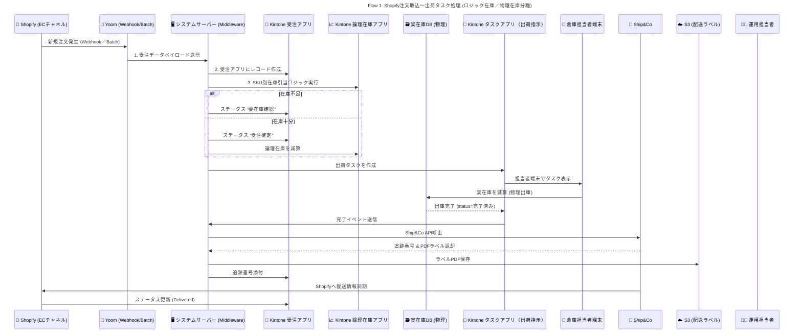

# Flow1: EC注文の自動取込・在庫引当と出荷処理

### 🎯 Mục tiêu

Luồng này mô tả quá trình từ khi đơn hàng được tạo trên **Shopify** đến khi hàng được giao đi, bao gồm:

- Đồng bộ đơn hàng từ Shopify sang Kintone (Orders App).
- Giữ hàng bằng **tồn kho logic (論理在庫)** khi đơn hàng được xác nhận.
- Tạo **task xuất kho (出荷タスク)** cho nhân viên kho xử lý thực tế.
- Trừ **tồn kho vật lý (実在庫)** khi hàng được quét và xuất kho.
- Phát hành vận đơn qua **Ship&Co** và đồng bộ trạng thái trở lại Shopify.
- Xử lý ngoại lệ: **Cancel / Return (chi tiết flow 9)**

---

### 🧩 Thành phần hệ thống

| Thành phần | Vai trò |
| --- | --- |
| 🛒 **Shopify (EC_Channel)** | Nguồn đơn hàng BtoC, nơi phát sinh order gốc. |
| 🔗 **Yoom** | Công cụ đồng bộ (Webhook/Batch) truyền dữ liệu từ Shopify về server. |
| 🖥️ **Ruby_Server (Middleware)** | Server trung gian xử lý logic, tạo record, quản lý API và điều phối hệ thống. |
| 📄 **Orders_App** | App Kintone lưu đơn hàng, trạng thái, tracking. |
| 📈 **Logic_Stock** | App Kintone quản lý tồn kho logic (luồng hệ thống). |
| 🗃️ **Physical_DB** | CSDL quản lý tồn kho vật lý (hàng thực tế tại kho). |
| 🧾 **Task_App** | App Kintone quản lý các task xuất hàng / nhập hàng. |
| 📱 **Warehouse_UI** | Giao diện ReactJS để nhân viên kho quét barcode, xác nhận xuất / nhập. |
| 🚚 **Ship&Co** | API phát hành vận đơn, in nhãn và gửi tracking. |
| ☁️ **S3_Storage** | Lưu trữ file nhãn vận chuyển (PDF). |
| 🧑‍💻 **Op_Staff** | Nhân viên vận hành: xử lý Cancel / Return thủ công. |

---

### ⚙️ Quy trình chi tiết

### **Giai đoạn 1 – Nhận đơn và giữ hàng (論理在庫引当)**

1. Khi có đơn mới trên **Shopify**, hệ thống **Yoom** gọi Webhook gửi dữ liệu sang **Ruby_Server**.
2. Ruby_Server chuẩn hóa dữ liệu và tạo **record đơn hàng** trong `Orders_App`.
3. Ruby_Server gọi `Logic_Stock` để kiểm tra tồn kho logic theo SKU.
4. Nếu **thiếu hàng** → cập nhật status: `要在庫確認 (Cần kiểm tra tồn kho)`.
5. Nếu **đủ hàng** → cập nhật status: `受注確定 (Đơn đã xác nhận)` và **trừ tồn kho logic** tương ứng.
    
    > Mục đích: đảm bảo hệ thống giữ lại lượng hàng dành cho đơn này, tránh oversell.
    > 

---

### **Giai đoạn 2 – Tạo task xuất kho và thao tác thực tế tại kho**

1. Sau khi đơn được xác nhận và giữ hàng logic xong, Ruby_Server tạo **出荷タスク (Shipping Task)** trong `Task_App`.
    - Thông tin gồm: OrderID, SKU, số lượng, vị trí kệ (Location), ghi chú đặc biệt nếu có.
2. Task hiển thị trên giao diện `Ware`
3. `house_UI` cho nhân viên kho.
4. Nhân viên kho quét **barcode sản phẩm** và **mã kệ (棚コード)** → xác nhận xuất kho.
5. Khi xác nhận hoàn tất, hệ thống trừ **tồn kho vật lý (実在庫)** trong `Physical_DB` theo SKU, Location, LOT.
6. `Task_App` nhận kết quả từ Physical_DB và cập nhật trạng thái task = `完了済み (Hoàn tất)`.

---

### **Giai đoạn 3 – Phát hành nhãn vận chuyển & đồng bộ**

1. Khi Task hoàn tất, `Task_App` gửi webhook đến `Ruby_Server`.
2. Ruby_Server gọi API `Ship&Co` để phát hành vận đơn.
3. Ship&Co trả về **tracking number** và **file PDF nhãn**.
4. Ruby_Server lưu file nhãn lên **S3 Storage**.
5. Cập nhật thông tin tracking và link nhãn về `Orders_App`.

---

### **Giai đoạn 4 – Đồng bộ với Shopify**

1. Ship&Co gửi thông tin vận chuyển (Fulfilled / Tracking) trực tiếp lên Shopify.
2. Shopify gửi webhook ngược về để cập nhật trạng thái `Delivered` trong `Orders_App`.

---

### **Giai đoạn 5 – Xử lý Cancel / Return**

| Trường hợp | Mô tả xử lý |
| --- | --- |
| **Cancel (Huỷ đơn)** | Tham khảo Flow9 |
| **Return (Trả hàng)** | Tham khảo Flow9 |

---

### 🧮 Logic tồn kho

| Loại tồn kho | Cập nhật khi | Mục đích |
| --- | --- | --- |
| **論理在庫 (Logic Stock)** | Khi xác nhận đơn / huỷ đơn / nhập lại hàng | Giữ hàng trong hệ thống, ngăn oversell |
| **実在庫 (Physical Stock)** | Khi nhân viên kho xuất hoặc nhập hàng thực tế | Quản lý tồn kho vật lý (棚・LOT単位) |

---

### ✅ Kết quả mong đợi

- Đơn hàng được xử lý theo đúng chu trình: Shopify → Kintone → Kho → Ship&Co → Shopify.
- Hệ thống tách biệt rõ **tồn kho logic** và **tồn kho vật lý**, đảm bảo dữ liệu khớp.
- Nhân viên kho thao tác qua **Warehouse_UI** để ghi nhận chính xác xuất/nhập hàng.
- Có thể xử lý được các trường hợp đặc biệt: **Cancel / Return** một cách tự động hoặc bán tự động.
- Tất cả dữ liệu (order, stock, task, tracking) được đồng bộ hai chiều, giảm sai lệch thủ công.

---

### 📈 Sequence Diagram

