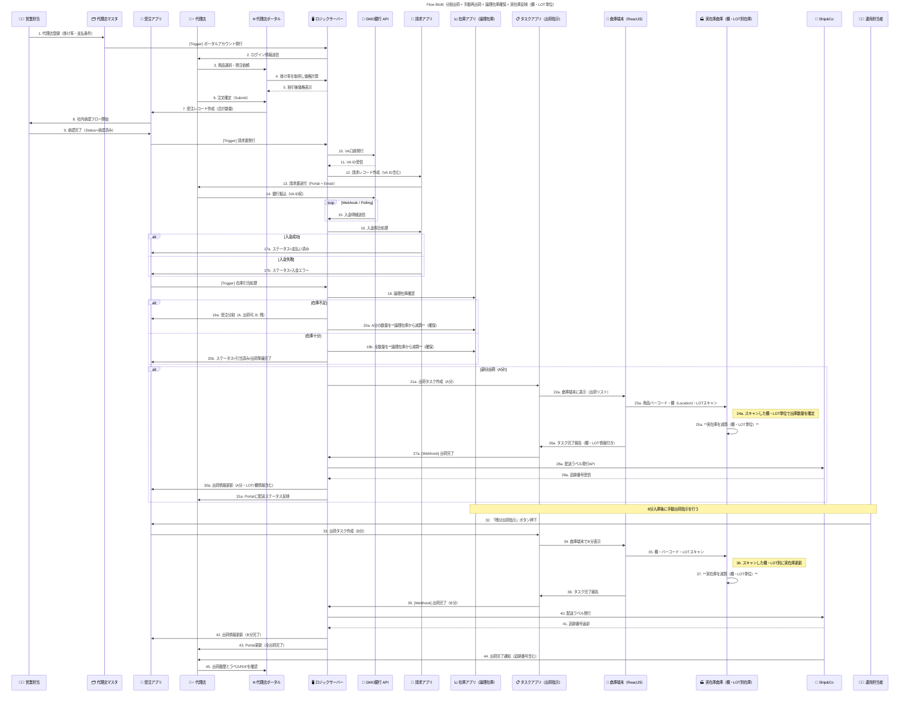

# Flow2: B2B 全体プロセス: 代理店/注文 出荷/配送



### 🎯 Mục tiêu

Quy trình xử lý đơn hàng BtoB có thể giao nhiều lần (分割出荷), đảm bảo hệ thống có thể:

- Giữ hàng (trừ tồn kho logic) ngay khi xác nhận đơn.
- Theo dõi và trừ kho vật lý chi tiết theo từng **kệ (Location)** và **LOT sản xuất (LOT番号)**.
- Cho phép vận hành viên tạo các lần giao hàng thủ công (手動再出荷).
- Đồng bộ hóa trạng thái giao hàng, invoice và tồn kho giữa các hệ thống.

---

### 🧩 Thành phần hệ thống tham gia

| Thành phần | Vai trò |
| --- | --- |
| 🧑‍💼 Sales_Staff | Nhân viên phụ trách đăng ký đại lý và phê duyệt đơn hàng |
| 🗂️ Partner_Master | App quản lý thông tin đại lý (loại đại lý, chiết khấu, tài khoản) |
| 📄 Orders_App | App quản lý đơn hàng |
| 🙋‍♂️ Agent | Đại lý (người đặt hàng) |
| 🌐 Portal | Giao diện web dành cho đại lý để đặt và theo dõi đơn hàng |
| 🖥️ Ruby_Server | Server xử lý logic, tạo VA ID, điều phối các app |
| 🏦 GMO_API | API ngân hàng để tạo tài khoản ảo (VA) và xác nhận thanh toán |
| 🧾 Invoice_App | App quản lý hóa đơn và đối soát thanh toán |
| 📈 Stock_App | App quản lý **tồn kho logic (論理在庫)** |
| 📋 Task_App | App quản lý các task xuất nhập kho |
| 📱 Warehouse_UI | Màn hình xuất nhập kho thực tế (ReactJS) để nhân viên kho quét mã |
| 🏭 Physical_Warehouse | Hệ thống quản lý **tồn kho vật lý (実在庫)**, theo từng kệ và LOT |
| 🚚 Ship&Co | Hệ thống tạo vận đơn và tracking |
| 🧑‍💻 Op_Staff | Nhân viên vận hành, thực hiện thao tác thủ công khi cần |

---

### ⚙️ Quy trình tổng thể

### 1️⃣ Đăng ký đại lý và tạo đơn hàng

1. Sales_Staff đăng ký đại lý trong **Partner_Master** (bao gồm loại đại lý, chiết khấu, tài khoản ngân hàng, v.v.)
2. Hệ thống tự động phát hành tài khoản Portal cho đại lý.
3. Đại lý đăng nhập Portal, chọn sản phẩm, xác nhận giá (có áp chiết khấu tự động).
4. Đại lý gửi đơn hàng → hệ thống tạo bản ghi trong **Orders_App**.
5. Sales_Staff phê duyệt nội bộ → trạng thái cập nhật thành `承認済み (Đã duyệt)`.

---

### 2️⃣ Phát hành hóa đơn & xác nhận thanh toán

1. Khi đơn hàng được duyệt, hệ thống tạo **VA ID (Tài khoản ảo)** qua **GMO API**.
2. Lưu VA ID vào **Invoice_App**, phát hành và gửi hóa đơn cho đại lý.
3. Đại lý thanh toán qua ngân hàng → GMO API gửi webhook kết quả về hệ thống.
4. **Ruby_Server** xác minh giao dịch:
    - Nếu **thành công** → cập nhật trạng thái đơn sang `支払い済み (Đã thanh toán)`
    - Nếu **thất bại** → cập nhật sang `入金エラー (Lỗi đối soát)`

---

### 3️⃣ Giữ hàng (trừ tồn kho logic)

1. Khi thanh toán thành công, hệ thống kích hoạt quá trình **引当 (Allocation)**:
    - **Stock_App** kiểm tra tồn kho logic.
    - Nếu đủ → trừ tồn kho logic tương ứng và cập nhật trạng thái `引当済み`.
    - Nếu thiếu → tách đơn thành hai phần:
        - A: Số lượng có thể giao ngay
        - B: Số lượng chờ sản xuất hoặc nhập thêm
        - A được trừ tồn logic, B giữ nguyên để chờ nhập kho bổ sung.

---

### 4️⃣ Xuất kho phần đầu tiên (A分)

1. **Ruby_Server** tạo **Task xuất kho** trong **Task_App** cho phần A.
2. Nhân viên kho mở **Warehouse_UI**, thấy danh sách hàng cần xuất.
3. Với từng sản phẩm, nhân viên:
    - Quét **barcode sản phẩm**
    - Quét **mã kệ (Location)**
    - Nhập hoặc quét **LOT番号**
4. Khi xác nhận:
    - Hệ thống ghi lại chi tiết `{SKU, Location_ID, LOT_No, Quantity}`
    - Trừ tồn trong **Physical_Warehouse** đúng dòng (棚・LOT単位)
    - Gửi kết quả hoàn thành về **Task_App** và **Orders_App**
5. **Ruby_Server** gọi **Ship&Co API** để tạo vận đơn, nhận tracking number.
6. Gửi thông tin giao hàng (tracking, ngày xuất, kệ, LOT) về Portal cho đại lý.

---

### 5️⃣ Xuất kho phần còn lại (B分)

1. Khi có hàng bổ sung, nhân viên vận hành nhấn `出荷指示 (Chỉ thị xuất hàng)` trong Orders_App.
2. Hệ thống tạo **Task mới** cho phần B trong Task_App.
3. Nhân viên kho lại thực hiện quét **barcode – kệ – LOT** trên Warehouse_UI.
4. Hệ thống trừ tồn vật lý đúng dòng `{SKU, Location_ID, LOT_No}`.
5. Sau khi hoàn thành, Task_App cập nhật trạng thái về Orders_App và thông báo đến Portal của đại lý.

---

### 6️⃣ Hoàn tất đơn hàng

1. Khi tất cả các phần xuất kho hoàn tất → Orders_App cập nhật trạng thái `出荷完了`.
2. Portal hiển thị đầy đủ lịch sử giao hàng, tracking, và file nhãn vận chuyển PDF (từ Ship&Co).

---

### 🧮 Logic tồn kho

| Loại tồn kho | Thời điểm cập nhật | Nguồn dữ liệu | Mục đích |
| --- | --- | --- | --- |
| **論理在庫 (Logic Stock)** | Khi xác nhận đơn / thanh toán xong | Stock_App | Giữ hàng, tránh overbooking |
| **実在庫 (Physical Stock)** | Khi nhân viên kho xác nhận xuất trên Warehouse_UI | Physical_Warehouse | Quản lý hàng thực tế, theo **Kệ & LOT** |

Cấu trúc dữ liệu cho Physical_Warehouse:

```json
{
  "SKU": "RS-500ML",
  "Product_Name": "Rice Silica 500mL",
  "Location_ID": "A-03",
  "LOT_No": "240101",
  "Quantity": 48,
  "Last_Updated": "2025-11-07T15:40:00Z",
  "Task_ID": "TASK-2025-1107-001"
}

```

---

### ⚠️ Xử lý ngoại lệ

| Trường hợp | Hành động |
| --- | --- |
| Đơn hàng bị huỷ (キャンセル) | Nếu **chưa xuất kho** → huỷ task và hoàn lại tồn logic.<br> Nếu **đã xuất kho** → tạo task nhập kho (Return Task) và tăng lại tồn vật lý theo đúng kệ, LOT. |
| Sai lệch kho | Thực hiện kiểm kê định kỳ theo kệ (Location Audit). |
| Lỗi thanh toán | Ghi log trong Payment Error App và xử lý thủ công. |

---

### ✅ Kết quả cuối cùng

- Hệ thống có thể theo dõi chính xác **tồn kho logic và vật lý tách biệt**.
- Có khả năng truy xuất nguồn gốc sản phẩm đến **LOT & vị trí lưu kho**.
- Các task xuất hàng, nhập hàng, hoàn hàng được ghi nhận và có thể audit.
- Đại lý có thể xem trạng thái giao hàng và tracking theo thời gian thực trên Portal.