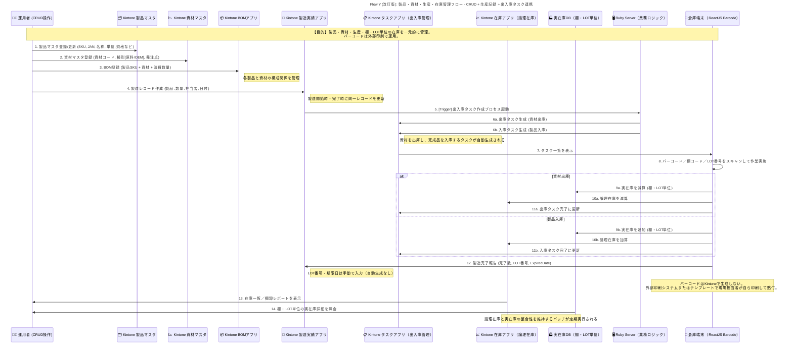

# Flow4: 製品・資材・製造・在庫管理フロー

### 🎯 Mục tiêu

Xây dựng luồng quản lý toàn bộ quy trình sản phẩm – vật tư – BOM – sản xuất – nhập xuất kho

trên nền Kintone, tích hợp màn hình quét barcode ReactJS, đảm bảo nhất quán giữa:

- **論理在庫 (Logic Stock)** – tồn kho hệ thống
- **実在庫 (Physical Stock)** – tồn kho thực tế theo từng **kệ (Location)** và **LOT番号**
- Không sử dụng WMS bên ngoài, barcode do **nhân viên tự in bên ngoài hệ thống**

---

### 🧩 Thành phần hệ thống tham gia

| Thành phần | Vai trò |
| --- | --- |
| 👨‍💻 Master_Admin | Người vận hành, quản lý CRUD master & ghi nhận sản xuất |
| 🗂️ Product_App | App quản lý sản phẩm (SKU, tên, quy cách, đơn vị, JAN code) |
| 📉 Material_App | App quản lý vật tư/nguyên liệu |
| 📦 BOM_App | App quản lý định mức vật tư cho từng sản phẩm |
| 🧾 Production_App | App ghi nhận sản xuất (số lượng, LOT, hạn sử dụng, người phụ trách) |
| 📋 Task_App | App quản lý task nhập kho / xuất kho sinh tự động |
| 📈 Stock_App | App quản lý tồn kho logic (論理在庫) |
| 🏭 Physical_DB | Database quản lý tồn kho vật lý (実在庫) theo kệ và LOT |
| 🖥️ Ruby_Server | Middleware xử lý nghiệp vụ (tạo task, cập nhật kho, điều phối dữ liệu) |
| 📱 Warehouse_UI | Màn hình ReactJS để nhân viên kho quét barcode, nhập LOT, hoàn tất task |

---

### ⚙️ Quy trình tổng thể

### 1️⃣ Tạo Master sản phẩm – vật tư – BOM

- Người vận hành đăng ký:
    - **Product_App**: SKU, tên, đơn vị, quy cách, JAN code
    - **Material_App**: mã vật tư, loại (原料/OEM), điểm đặt hàng
    - **BOM_App**: liên kết sản phẩm + vật tư + định mức tiêu hao
- Kiểm tra tính toàn vẹn dữ liệu (SKU và Material phải tồn tại, active)

---

### 2️⃣ Ghi nhận sản xuất (製造開始・完了)

- Khi bắt đầu hoặc hoàn tất sản xuất, tạo record trong **Production_App**
- Nhập các thông tin:
    - Sản phẩm (SKU), số lượng, người phụ trách, ngày sản xuất
    - Khi hoàn tất: nhập **LOT番号** và **期限日 (Expired Date)**
- LOT và Expired Date do nhân viên nhập thủ công (không tự động gán)
- Khi ghi nhận sản xuất, hệ thống (Ruby_Server) sẽ kích hoạt logic tạo Task

---

### 3️⃣ Sinh Task nhập/xuất kho tự động

- Khi bắt đầu sản xuất (開始):
    - Ruby_Server đọc BOM và tạo **Task 出庫 (xuất kho)** cho vật tư tương ứng
- Khi hoàn tất sản xuất (完了):
    - Ruby_Server tạo **Task 入庫 (nhập kho)** cho thành phẩm vừa sản xuất
- Mỗi Task bao gồm:
    - Loại tác vụ (入庫/出庫), SKU, số lượng, người phụ trách, trạng thái ban đầu = `未開始`

---

### 4️⃣ Thực hiện Task tại kho (Warehouse_UI)

- Nhân viên kho mở **Warehouse_UI (ReactJS)** để thao tác với các Task.
- Các bước thực hiện:
    1. Chọn Task cần xử lý
    2. Quét **Barcode sản phẩm hoặc vật tư**
    3. Quét **Mã kệ (棚コード)**
    4. Nhập hoặc quét **LOT番号**
    5. Nhập **số lượng thực tế** và nhấn **完了**
- Khi hoàn tất:
    - Nếu là **出庫 (vật tư)**:
        - Giảm tồn kho vật lý trong **Physical_DB** (棚・LOT単位)
        - Giảm tồn kho logic trong **Stock_App**
    - Nếu là **入庫 (thành phẩm)**:
        - Tăng tồn kho vật lý trong **Physical_DB**
        - Tăng tồn kho logic trong **Stock_App**
    - Trạng thái Task cập nhật → `完了済み`

---

### 5️⃣ Quản lý LOT và Barcode

- **LOT番号** và **期限日** do nhân viên tự nhập khi hoàn tất sản xuất.
- **Barcode không in từ Kintone**:
    - Nhân viên tự in barcode từ template bên ngoài (Excel hoặc máy in chuyên dụng)
    - Dán thủ công lên sản phẩm trước khi nhập kho
- Hệ thống chỉ dùng barcode để quét nhận diện khi thao tác task

---

### 6️⃣ Quản lý tồn kho & báo cáo

- **Stock_App (論理在庫)**: phản ánh tổng tồn hệ thống theo SKU.
- **Physical_DB (実在庫)**: ghi nhận tồn thực tế theo SKU + Location + LOT.
- Ruby_Server thực hiện batch đối chiếu định kỳ giữa Logic/Physical stock:
    - Báo cáo chênh lệch (SKU, LOT, chênh lệch tồn, %)
- Có thể lọc tồn kho theo:
    - SKU
    - LOT番号
    - 棚コード (mã kệ)

---

### 🧮 Logic tồn kho

| Loại tồn kho | Khi tăng | Khi giảm | Nguồn thay đổi |
| --- | --- | --- | --- |
| **論理在庫 (Logic Stock)** | Nhập thành phẩm | Xuất vật tư hoặc xuất hàng bán | Stock_App |
| **実在庫 (Physical Stock)** | Khi nhân viên xác nhận nhập kho thực tế | Khi nhân viên xác nhận xuất kho thực tế | Physical_DB |

---

### ⚠️ Ngoại lệ & Xử lý đặc biệt

| Trường hợp | Hành động |
| --- | --- |
| Nhập sai LOT hoặc mã kệ | Hiển thị cảnh báo, yêu cầu nhập lại |
| Trùng LOT trên cùng kệ | Cảnh báo nhưng cho phép nếu cùng sản phẩm |
| Hủy sản xuất | Ruby_Server hủy Task và rollback tồn logic |
| Sai lệch kho | Có thể chỉnh thủ công trên Physical_DB (ghi log) |
| Barcode lỗi hoặc mất | Nhân viên tự in lại từ hệ thống ngoài |

---

### ✅ Kết quả mong đợi

- Toàn bộ quy trình sản xuất và kho được quản lý tập trung trong Kintone
- Không phụ thuộc WMS ngoài, phù hợp môi trường vận hành thực tế
- Tồn kho logic và vật lý luôn khớp, có thể audit đến từng **LOT & 棚**
- Nhân viên kho thao tác nhanh bằng **quét barcode ReactJS UI**
- Dữ liệu traceable đầy đủ theo SKU, LOT và thời gian

---