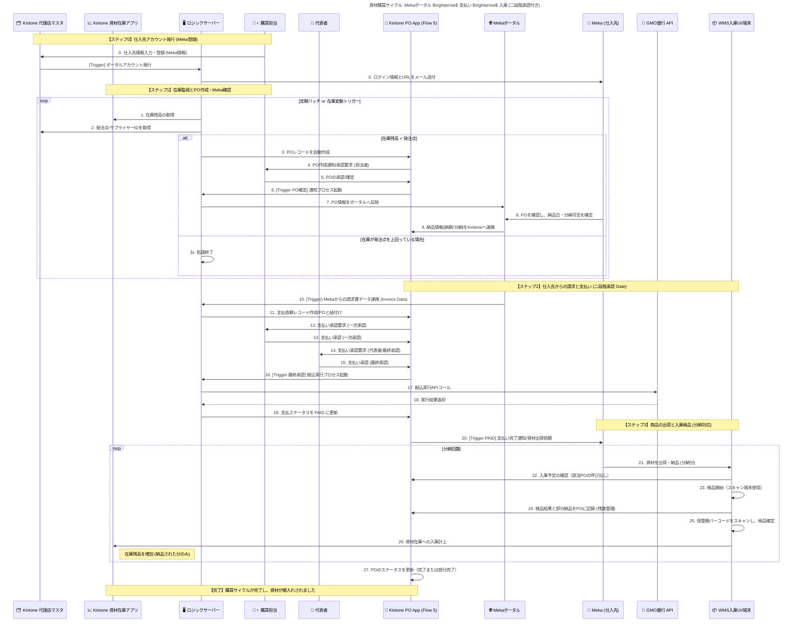

# Flow5: 資材購買サイクル

### 🎯 Mục tiêu

Quy trình này quản lý toàn bộ vòng đời **mua hàng vật tư (資材購買)** từ việc giám sát tồn kho, tạo đơn đặt hàng (PO), phê duyệt, thanh toán, đến nhập kho nhiều đợt (分納).

Hệ thống được tích hợp chặt chẽ với **Meka Portal** và **GMO銀行API** để tự động hóa luồng dữ liệu giữa nhà cung cấp và Kintone.

Mục tiêu chính:

- **Loại bỏ WMS cũ**, thay bằng **Warehouse_UI (ReactJS)** để quét barcode khi nhập kho.
- Thanh toán **1 lần duy nhất trước khi nhận hàng**, nhưng **cho phép chia nhiều lần giao hàng (分納)**.
- Quy trình **2 cấp phê duyệt**:
    - Cấp 1: duyệt PO trong Kintone (Purchasing_Staff)
    - Cấp 2: duyệt thanh toán trong Payout App (CEO)
- Sau phê duyệt cuối → tự động **chuyển khoản qua GMO API**, cập nhật trạng thái thanh toán & giao hàng giữa Kintone và Meka Portal.

---

### 🧩 Thành phần hệ thống tham gia

| Thành phần | Vai trò |
| --- | --- |
| 🗂️ Partner_Master | Quản lý thông tin nhà cung cấp Meka (tài khoản ngân hàng, liên hệ, ID portal) |
| 📈 Stock_App | Theo dõi tồn kho vật tư và ngưỡng đặt hàng (発注点) |
| 🖥️ Ruby_Server | Xử lý logic tự động: tạo PO, gọi API GMO, đồng bộ dữ liệu với Meka Portal |
| 🙋‍♀️ Purchasing_Staff | Nhân viên mua hàng — phê duyệt cấp 1 (一次承認) |
| 👑 Representative | CEO — phê duyệt cấp 2 (最終承認) trước khi chuyển khoản |
| 📝 PO_App | Quản lý đơn đặt hàng (PO), phê duyệt cấp 1 và trạng thái nhập kho |
| 💸 Payout_App | Quản lý thanh toán (tạo sau duyệt cấp 2, gắn link PO) |
| 🌐 Meka_Portal | Hệ thống portal nhà cung cấp (xác nhận đơn, phát hành invoice, chia batch giao hàng) |
| 🚚 Meka | Nhà cung cấp vật tư |
| 🏦 GMO_API | API ngân hàng thực hiện chuyển khoản tự động |
| 📱 Warehouse_UI | Màn hình nhập kho (ReactJS), dùng để quét barcode, kệ, LOT khi nhập hàng |

---

### ⚙️ Quy trình chi tiết

### 1️⃣ Đăng ký nhà cung cấp (Meka)

- Nhân viên mua hàng tạo record **Meka Supplier** trong `Partner_Master` (bao gồm tên, email, tài khoản ngân hàng).
- Ruby_Server tự động phát hành tài khoản Meka trên **Meka Portal** và gửi email đăng nhập.

---

### 2️⃣ Giám sát tồn kho và tạo PO tự động

- Ruby_Server định kỳ kiểm tra dữ liệu tồn kho từ **Stock_App**.
- Khi phát hiện SKU có số lượng < 発注点 (ngưỡng đặt hàng):
    1. Ruby_Server tự động tạo record **PO** trong `PO_App`.
    2. Gửi thông báo cho **Purchasing_Staff** để phê duyệt cấp 1.
    3. Purchasing_Staff xem xét và phê duyệt (`一次承認`).
    4. Ruby_Server gửi PO sang **Meka Portal**.
    5. Meka xác nhận đơn hàng, chọn ngày giao và số lần chia lô (分納).
    6. Lịch giao hàng được phản ánh ngược lại về `PO_App`.

---

### 3️⃣ Thanh toán (一次承認 + 最終承認 + 自動振込)

### 🧾 Bước 1: Nhận invoice và tạo record thanh toán

- Meka Portal gửi dữ liệu **invoice (請求書)** sang **Ruby_Server**.
- Ruby_Server tạo record **支払依頼 (Yêu cầu thanh toán)** trong `Payout_App`, gắn link đến PO tương ứng.

### 🧍‍♀️ Bước 2: Phê duyệt cấp 1 (PO)

- Trước đó, **PO_App** đã được duyệt cấp 1 bởi **Purchasing_Staff** khi xác nhận đơn hàng.
- Đây là xác nhận nội bộ cho phép tiếp tục quá trình thanh toán.

### 👑 Bước 3: Phê duyệt cấp 2 (Payout)

- **Representative (CEO)** mở record trong `Payout_App` và thực hiện **最終承認 (duyệt cấp 2)**.
- Sau khi duyệt, Kintone gửi trigger Webhook tới **Ruby_Server**.

### 🤖 Bước 4: Tự động thực hiện chuyển khoản

- Ruby_Server gọi **GMO_API /payments** để thực hiện chuyển khoản.
- Khi giao dịch thành công:
    - Cập nhật `Payout_App.Status = 完了`
    - Cập nhật `PO_App.Status = PAID`
    - Gửi phản hồi sang **Meka Portal** (hiển thị “支払い済み”)
- Nếu lỗi khi gọi API → ghi log vào `Payment Error App` và gửi email cảnh báo cho nhân viên mua hàng.

---

### 4️⃣ Nhập kho nhiều đợt (分納対応)

Sau khi Meka nhận được thông báo thanh toán hoàn tất:

1. Meka chia đơn hàng thành các **batch giao hàng**.
2. Mỗi batch được xác nhận trên **Meka Portal** → gửi API trigger đến Ruby_Server.
3. Ruby_Server:
    - Cập nhật `PO_App.Status = 部分入庫中`
    - Tự động tạo **Task nhập kho (入庫タスク)** trong **Warehouse_UI**
4. Nhân viên kho thực hiện nhập hàng qua **Warehouse_UI**:
    - Quét **barcode sản phẩm**
    - Quét **mã kệ (棚コード)**
    - Nhập **LOT番号**
    - Xác nhận hoàn tất → hệ thống:
        - Cộng tồn kho logic trong **Stock_App**
        - Ghi nhận batch nhập vào **PO_App**
        - Nếu chưa hoàn tất toàn bộ: `PO_App.Status = 部分完了`
        - Nếu đã nhập đủ: `PO_App.Status = 完了`
5. Ruby_Server đồng bộ trạng thái nhập kho sang **Meka Portal** (đánh dấu “納品済み”).

---

### 🧮 Logic tồn kho

| Loại tồn kho | Thời điểm cập nhật | Khi tăng | Khi giảm |
| --- | --- | --- | --- |
| **論理在庫 (Logic Stock)** | Khi xác nhận nhập hàng trên Warehouse_UI | Sau khi nhập batch vật tư | Khi vật tư được sử dụng cho sản xuất |
| **実在庫 (Physical Stock)** | Quản lý tại Warehouse_UI (棚・LOT単位) | Khi nhân viên quét barcode và xác nhận nhập | Khi xuất vật tư thực tế |

---

### ⚠️ Ngoại lệ & Xử lý lỗi

| Tình huống | Hành động |
| --- | --- |
| Lỗi khi chuyển khoản (GMO_API Error) | Ruby ghi log vào `Error App` và gửi thông báo cho nhân viên mua hàng |
| Giao thiếu hàng | Giữ `PO_App.Status = 部分入庫中` đến khi batch kế tiếp được nhập |
| Hủy PO sau khi đã thanh toán | Tạo record hoàn tiền (Refund) thủ công trong `Payout_App` |
| Không nhập đủ thông tin LOT hoặc mã kệ | Warehouse_UI hiển thị cảnh báo, không cho phép “完了” |
| Sai lệch tồn kho | Cho phép điều chỉnh thủ công trong `Stock_History_App` (ghi log lịch sử) |

---

### ✅ Kết quả mong đợi

- Quy trình mua hàng được tự động hóa hoàn toàn, hỗ trợ chia batch giao hàng (分納).
- Phê duyệt 2 cấp được tách rõ ràng giữa `PO_App` và `Payout_App`.
- Thanh toán được thực hiện tự động qua **GMO API**, không cần thao tác thủ công.
- Trạng thái thanh toán và nhập kho được đồng bộ 2 chiều giữa **Kintone** và **Meka Portal**.
- Mọi hành động đều được ghi lại trên các app liên quan (`PO_App`, `Payout_App`, `Stock_App`, `Warehouse_UI`) giúp audit dễ dàng.

---