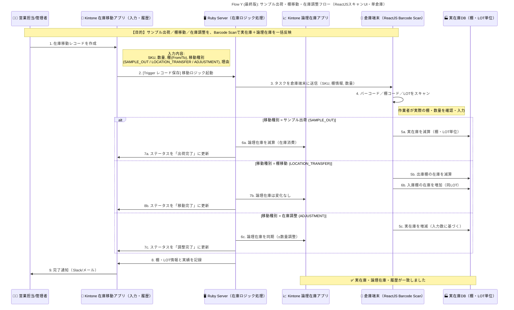

# Flow6: サンプル出荷・返品・棚移動・在庫調整

### 

（Quy trình xuất mẫu, hoàn hàng, di chuyển kệ và điều chỉnh tồn kho – dùng ReactJS Barcode Scan）

---

### 🎯 Mục tiêu

Thiết lập quy trình vận hành thống nhất cho toàn bộ nghiệp vụ xuất nhập kho **nội bộ**, bao gồm:

- **返品 (Hoàn hàng)**: nhập hàng hoàn trả sau khi bán.
- **サンプル出荷 (Xuất mẫu)**: xuất kho dùng thử hoặc gửi mẫu.
- **棚移動 (Di chuyển kệ)**: chuyển hàng giữa các vị trí trong cùng kho.
- **在庫調整 (Điều chỉnh kho)**: xử lý sai lệch, chênh lệch kiểm kê hoặc sửa tồn thực tế.

Tất cả các thao tác này được thực hiện qua **ReactJS Warehouse UI** (màn hình quét barcode),

và dữ liệu được đồng bộ **tức thời** giữa:

- **Kintone** (luồng nghiệp vụ và tồn logic)
- **Physical_DB** (tồn vật lý thực tế theo kệ, LOT)

---

### 🧩 Thành phần tham gia

| Thành phần | Vai trò | Ghi chú |
| --- | --- | --- |
| 🧑‍💼 **Sales_Staff / 管理者** | Người tạo hoặc phê duyệt yêu cầu di chuyển, xuất mẫu, hoàn hàng | Thực hiện trực tiếp trong Kintone |
| 📄 **StockMovement_App** | App trung tâm lưu record các hoạt động di chuyển/điều chỉnh/hoàn hàng | Có các trường: SKU, Qty, From/To Shelf, Type, Reason, LOT |
| 🖥️ **Ruby_Server** | Xử lý logic tồn kho (điều chỉnh logic, đồng bộ Physical_DB) | Trigger bởi sự kiện record save/update |
| 📱 **Warehouse_UI (ReactJS)** | Màn hình quét barcode tại kho | Cho phép nhân viên nhập mã hàng, kệ, LOT và xác nhận kết quả |
| 🏭 **Physical_DB** | CSDL quản lý tồn vật lý chi tiết theo từng kệ (Location) và LOT | Dữ liệu thực tế tại kho |
| 📈 **Stock_App** | App tồn kho logic trên Kintone | Dữ liệu logic cho báo cáo và hệ thống |

---

### ⚙️ Quy trình tổng thể

### 🩵 1️⃣ Tạo yêu cầu di chuyển hoặc hoàn hàng

- **Sales_Staff** tạo mới một record trong **StockMovement_App**
- Nhập các thông tin:
    - SKU, Số lượng
    - Loại giao dịch (**Type**):
        - `RETURN` → Nhập hàng hoàn trả
        - `SAMPLE_OUT` → Xuất mẫu
        - `LOCATION_TRANSFER` → Di chuyển kệ
        - `ADJUSTMENT` → Điều chỉnh kho
    - Vị trí kệ From / To (nếu có)
    - LOT và lý do (tùy chọn)
- Sau khi lưu, Kintone trigger **Webhook → Ruby_Server**

---

### 🩵 2️⃣ Gửi task đến màn hình kho (Warehouse_UI)

- **Ruby_Server** tạo một “task” chứa:
    - SKU, số lượng, vị trí From/To, loại giao dịch
- Task này hiển thị trên **Warehouse_UI** (ReactJS Barcode Scan)
- Nhân viên kho sẽ:
    - Quét barcode sản phẩm
    - Nhập hoặc quét **mã kệ (Shelf Code)**
    - Nhập hoặc quét **mã LOT**
    - Xác nhận số lượng thực tế

---

### 🩵 3️⃣ Thực thi logic tồn kho (Logic + Physical)

Tùy theo loại giao dịch (`Type`), Ruby_Server xử lý khác nhau:

| Type | Hành động vật lý | Hành động logic | Cập nhật trạng thái |
| --- | --- | --- | --- |
| **返品 (Return)** | Tăng tồn kho thực tế trong **Physical_DB** theo kệ & LOT | Tăng tồn logic trong **Stock_App** | `返品完了 (Hoàn hàng xong)` |
| **サンプル出荷 (Sample Out)** | Giảm tồn vật lý (xuất hàng khỏi kệ) | Giảm tồn logic (ghi nhận tiêu hao) | `出荷完了` |
| **棚移動 (Location Transfer)** | Giảm tồn ở kệ A → Tăng ở kệ B (cùng LOT) | Không đổi tồn logic | `移動完了` |
| **在庫調整 (Adjustment)** | Tăng/giảm tồn thực tế theo số nhập | Điều chỉnh tồn logic tương ứng (±Qty) | `調整完了` |

---

### 🩵 4️⃣ Lưu lịch sử và thông báo

- Ruby_Server ghi lại vào **StockMovement_App**:
    - Kết quả thực tế (LOT, shelf, số lượng, ngày giờ)
    - Người thao tác
- Gửi thông báo hoàn tất qua Slack / Email đến Sales_Staff.
- Có thể export báo cáo giao dịch để kiểm soát định kỳ.

---

### 🧾 Cấu trúc dữ liệu mẫu (StockMovement_App)

| Trường | Kiểu dữ liệu | Mô tả |
| --- | --- | --- |
| Record ID | Auto | ID của bản ghi |
| Type | Enum | `RETURN / SAMPLE_OUT / LOCATION_TRANSFER / ADJUSTMENT` |
| SKU | Text | Mã sản phẩm |
| Quantity | Number | Số lượng thao tác |
| From_Location | Text | Kệ xuất |
| To_Location | Text | Kệ nhập |
| LOT | Text | LOT sản xuất hoặc nhập hàng |
| Reason | Text | Lý do thao tác |
| Operator | User | Nhân viên kho thực hiện |
| Status | Enum | `完了 / 未完了 / エラー` |
| Executed_At | DateTime | Thời điểm hoàn tất |

---

### 🔔 Lưu ý vận hành

- Các loại `ADJUSTMENT` và `RETURN` có thể được dùng để xử lý các tình huống đặc biệt:
    - Nhập lại hàng hoàn khi đơn bị huỷ sau xuất kho.
    - Điều chỉnh sai lệch do kiểm kê hoặc sản phẩm lỗi.
- `Warehouse_UI` có thể vận hành **offline** (cache local) trong trường hợp mất kết nối,
sau đó **đồng bộ lại** với Ruby_Server khi có mạng.
- Dữ liệu Physical_DB và Logic Stock luôn phải khớp,
kiểm tra định kỳ 1 lần/tháng bằng báo cáo “棚卸 (Inventory Audit)”.

---

### ✅ Kết quả cuối cùng

- Quản lý được toàn bộ hoạt động kho **nội bộ & hoàn hàng** trong một hệ thống thống nhất.
- **StockMovement_App** trở thành trung tâm ghi nhận và tracking lịch sử tồn kho.
- **Ruby_Server** đảm bảo đồng bộ 2 chiều giữa **Logic Stock (Kintone)** và **Physical Stock (DB)**.
- **Warehouse_UI** giúp thao tác nhanh bằng quét mã, tránh sai sót thủ công.

---

📘 **Tổng kết**

> Với flow này, Credie có thể quản lý xuất nhập kho nội bộ, hoàn hàng và điều chỉnh thực tế
> 
> 
> chỉ bằng 1 hệ thống ReactJS + Kintone duy nhất,
> 
> vừa linh hoạt trong vận hành, vừa dễ kiểm soát audit & reconciliation hàng tháng.
>