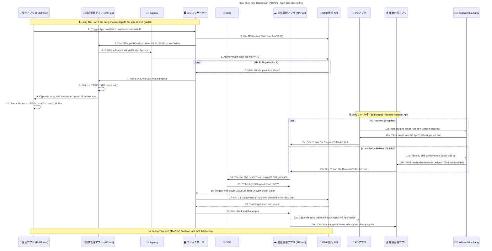

# Flow7: 支払いフロー

## 💰 Flow Tổng hợp Thanh toán (AR/AP)

（受注請求・支払管理の統合フロー：Kintone × Ruby Server × GMO API）

---

### 🎯 Mục tiêu

Thiết lập quy trình **thu – chi (AR/AP)** thống nhất trong hệ thống Credie,

phân tách rõ giữa hai luồng:

- **AR (Accounts Receivable)** – Thu tiền từ khách hàng / đại lý
- **AP (Accounts Payable)** – Chi tiền cho nhà cung cấp / đại lý / commission

Tất cả được đồng bộ và tự động hoá qua **Ruby Server** với **GMO銀行API**,

đảm bảo luồng tiền minh bạch, theo dõi 2 chiều và có phê duyệt nội bộ.

---

### 🧩 Thành phần tham gia

| Thành phần | Vai trò | Ghi chú |
| --- | --- | --- |
| 📄 **Orders_App** | Quản lý đơn hàng bán (Sales Orders) | Nguồn phát sinh doanh thu |
| 🧾 **Invoice_App (AR Hub)** | App quản lý hoá đơn và VA ID | Xử lý phát hành, đối soát, trạng thái thanh toán |
| 🙋‍♂️ **Agent / Agency** | Đại lý hoặc khách hàng | Người thanh toán qua tài khoản ảo (VA ID) |
| 🖥️ **Ruby_Server** | Xử lý logic trung gian giữa Kintone và GMO API | Gọi API, cập nhật trạng thái, khớp dữ liệu |
| 👑 **Representative (CEO)** | Phê duyệt cấp cao (chi tiền) | Phê duyệt cuối trước khi chuyển khoản |
| 💵 **Payment_Request_App (AP Hub)** | App quản lý lệnh chi & payout | Nơi tập hợp các yêu cầu thanh toán từ nhiều nguồn |
| 🏦 **GMO_API** | API của Ngân hàng GMO | Dịch vụ tài khoản ảo (VA) và chuyển khoản hàng loạt |
| 📝 **PO_App** | Quản lý đơn mua hàng / thanh toán nhà cung cấp | Tạo yêu cầu thanh toán cho Supplier |
| 💰 **Rewards_Ledger** | Quản lý payout commission và rebate cho đại lý | Gửi lệnh chi định kỳ đến AP Hub |
| 👩‍💼 **Accounting_Staff** | Nhân viên kế toán hoặc mua hàng | Người thực hiện phê duyệt nội bộ (cấp 1) |

---

### ⚙️ Quy trình chi tiết

---

### 🩵 **I. Luồng Thu (AR Flow) – Invoice & Đối soát tiền về**

### 1️⃣ Phát hành hoá đơn và tạo tài khoản ảo (VA)

1. Khi **Orders_App** được phê duyệt (`Status = Approved`),
→ trigger sang **Ruby_Server** để khởi tạo quy trình thanh toán.
2. Ruby_Server gọi **GMO API** tạo **VA ID (Virtual Account)**.
3. Ruby_Server tạo record trong **Invoice_App**, bao gồm:
    - Mã VA ID
    - Số tiền cần thanh toán
    - Thông tin liên kết Order
    - Hạn thanh toán
4. **Invoice_App** gửi email / thông báo chứa **VA ID** cho **Agency**.

### 2️⃣ Thanh toán và đối soát tự động

1. **Agency** chuyển tiền vào **VA ID** do GMO cấp.
2. **GMO_API** gửi webhook / polling định kỳ về Ruby_Server với dữ liệu giao dịch.
3. Ruby_Server đối chiếu VA ID → cập nhật record trong **Invoice_App**:
    - `Status = PAID`
    - Lưu thời gian nhận tiền và transaction ID
4. **Invoice_App** cập nhật ngược trạng thái về **Orders_App**:
    - `Order.Status = PAID`
    - Tự động kích hoạt luồng xuất kho (Fulfillment).

> 💡 Như vậy, dòng tiền AR hoàn toàn tự động, không cần upload file CSV hoặc xác nhận thủ công.
> 

---

### 💛 **II. Luồng Chi (AP Flow) – Phê duyệt & Thanh toán ra**

### 3️⃣ Tập hợp lệnh chi (Payment Requests)

Các app nghiệp vụ như **PO_App** (mua hàng) hoặc **Rewards_Ledger** (payout hoa hồng)

sẽ gửi yêu cầu thanh toán sang **Payment_Request_App**.

| Nguồn | Bước | Nội dung |
| --- | --- | --- |
| **PO_App** | ① Nhân viên kế toán duyệt PO nội bộ | Phê duyệt nội bộ (`一次承認`) |
|  | ② PO_App gửi record sang Payment_Request_App | Gồm Supplier, Số tiền, Ngân hàng |
| **Rewards_Ledger** | ① Kế toán duyệt payout batch nội bộ | Phê duyệt nội bộ |
|  | ② Rewards_Ledger gửi record sang Payment_Request_App | Gồm Agency, Số tiền, đợt payout |

Khi record mới được tạo trong Payment_Request_App → trigger kiểm tra hợp lệ (số dư, phí, v.v.)

---

### 4️⃣ Phê duyệt CEO và thực hiện chuyển khoản

1. **Payment_Request_App** gửi yêu cầu phê duyệt tới **CEO (Representative)**.
2. Sau khi CEO nhấn **“承認 (Phê duyệt)”**, app gọi Webhook → **Ruby_Server**.
3. Ruby_Server gom các record **READY FOR PAYMENT** →
gọi **GMO_API /payments** để thực hiện **batch chuyển khoản**.
4. **GMO_API** trả kết quả (thành công / thất bại + phí).
5. Ruby_Server ghi lại kết quả:
    - `Payment_Request.Status = 完了 (Đã thanh toán)`
    - Ghi phí (fee), mã giao dịch, thời gian chuyển tiền.
6. Ruby_Server đồng bộ kết quả ngược về app nguồn:
    - Với **PO_App** → `Status = Paid`
    - Với **Rewards_Ledger** → `Status = Paid`

---

### 🧾 Luồng dữ liệu tổng thể (Data Flow)

| App | Dữ liệu lưu | Trigger / Action |
| --- | --- | --- |
| **Orders_App** | OrderID, Số tiền, Trạng thái | Trigger tạo Invoice |
| **Invoice_App** | VA ID, Payment Status, Date | Cập nhật từ GMO → Ruby |
| **PO_App** | Supplier, Amount, Due Date | Gửi lệnh chi sang Payment_Request |
| **Rewards_Ledger** | Partner, Reward, Period | Gửi lệnh chi sang Payment_Request |
| **Payment_Request_App** | Tổng hợp các khoản chi, phí, trạng thái | Trigger phê duyệt CEO + API GMO |
| **Ruby_Server** | Logic xử lý trung gian | Gọi GMO API, cập nhật trạng thái |
| **GMO_API** | Kênh tài chính (VA / Payment Batch) | Cung cấp dữ liệu tiền vào & chuyển khoản |

---

### 🔐 Cơ chế kiểm soát & bảo mật

| Cấp phê duyệt | App | Mục đích |
| --- | --- | --- |
| **Cấp 1 – Nội bộ (Accounting_Staff)** | `PO_App`, `Rewards_Ledger` | Kiểm tra nghiệp vụ & tính hợp lệ |
| **Cấp 2 – CEO (Representative)** | `Payment_Request_App` | Kiểm soát dòng tiền trước khi chuyển |
| **Tự động – GMO_API** | `Ruby_Server` | Đảm bảo xử lý chính xác qua API an toàn |

---

### ⚠️ Trường hợp ngoại lệ

| Tình huống | Hành động xử lý |
| --- | --- |
| Thanh toán thất bại (API trả lỗi) | Ruby_Server cập nhật `Status = Failed`, log lỗi và gửi cảnh báo Email |
| Sai lệch số tiền / VA ID không khớp | Record được giữ ở trạng thái `要確認` trong Invoice_App để kế toán xử lý thủ công |
| Phí ngân hàng phát sinh | Ruby_Server tự động ghi `Transfer_Fee` vào Payment_Request_App |
| Thay đổi thông tin ngân hàng supplier | Payment_Request_App gửi cảnh báo xác minh lại trước khi duyệt CEO |

---

### ✅ Kết quả cuối cùng

- **Toàn bộ dòng tiền thu & chi được tự động hoá**,
đồng bộ giữa **Kintone – Ruby Server – GMO API**.
- **VA ID** đảm bảo tracking chi tiết từng khoản thu (AR).
- **Batch Payment** cho phép thanh toán hàng loạt, có kiểm duyệt 2 cấp (AP).
- **Payment_Request_App** đóng vai trò trung tâm kiểm soát tiền ra,
trong khi **Invoice_App** là trung tâm tiền vào.

---

📘 **Tổng kết:**

> Hệ thống Credie đạt được mô hình "Two-way cash flow automation",
> 
> 
> tách biệt rõ trách nhiệm:
> 
> - **AR (Invoice_App)** chịu trách nhiệm thu tiền.
> - **AP (Payment_Request_App)** chịu trách nhiệm chi tiền.
> → Toàn bộ hoạt động đều được ghi log, có phê duyệt, và truy xuất lịch sử hoàn chỉnh.