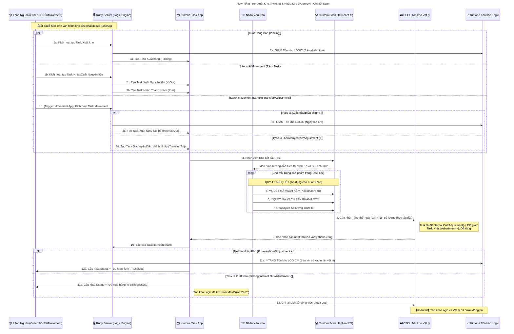

# Flow8: 倉庫作業のフロー

（出庫・入庫フロー：Kintone × Ruby Server × ReactJS Scan UI）

---

### 🎯 Mục tiêu

Quy trình này chuẩn hóa **toàn bộ luồng vận hành kho hàng** (Warehouse Operation) bao gồm:

- **Xuất hàng (Picking)** cho đơn bán, sản xuất, movement nội bộ
- **Nhập hàng (Putaway)** cho đơn mua, sản xuất hoặc hoàn hàng
- **Điều chỉnh và di chuyển kho (Adjustment / Transfer)**
- **Theo dõi tồn kho thực tế (Vật lý) và tồn kho hệ thống (Logic)**

Mục tiêu:

→ Mọi tác vụ kho đều được kiểm soát thông qua **TaskApp** (trung tâm điều phối),

→ Thao tác thực tế được nhân viên kho thực hiện bằng **ReactJS Scan UI**,

→ Sau khi quét barcode, hệ thống tự động cập nhật cả **CSDL vật lý (DB)** và **Tồn kho logic (Stock_App)**.

---

### 🧩 Thành phần tham gia

| Thành phần | Vai trò | Ghi chú |
| --- | --- | --- |
| 📦 **Order/PO/SX/Movement Apps** | Nguồn phát sinh lệnh (đơn bán, đơn mua, sản xuất, điều chuyển) | Gửi trigger tạo Task cho Ruby Server |
| 🖥️ **Ruby_Server** | Xử lý trung gian – tạo Task, trừ/tăng tồn logic, đồng bộ DB | Logic Engine chính |
| 🗂️ **TaskApp** | App trung tâm tạo và quản lý Task Xuất / Nhập kho | Có record riêng cho từng thao tác |
| 👩‍🔧 **Nhân viên Kho (Staff)** | Người trực tiếp thao tác tại kho | Sử dụng Scan UI để xác nhận hàng hóa |
| 💻 **Scan_UI (ReactJS)** | Màn hình quét barcode tại kho | Hiển thị SKU, Kệ, Số lượng, LOT |
| 🗃️ **DB (Physical Stock)** | CSDL tồn kho vật lý theo **Kệ – LOT – Số lượng** | Lưu dữ liệu thực tế tại kho |
| 📈 **Stock_App (Logic Stock)** | Tồn kho logic trong Kintone | Dùng cho phân tích và báo cáo tồn |

---

### ⚙️ Quy trình chi tiết

### 🩵 **1️⃣ Tạo Task & Xử lý Logic ban đầu**

Tất cả các loại lệnh kho (Sales Order, Purchase Order, Production, Movement)

đều đi qua **Ruby_Server** để sinh **Task trong TaskApp**.

### 🧾 Các loại Task chính:

| Nguồn | Task | Loại thao tác | Ảnh hưởng tồn kho Logic |
| --- | --- | --- | --- |
| **Order (Bán)** | Picking | Xuất hàng | Giảm tồn logic (ngay khi tạo Task) |
| **PO (Mua)** | Putaway | Nhập hàng | Tăng tồn logic (sau khi xác nhận nhập vật lý) |
| **Sản xuất (Production)** | X-Out / X-In | Xuất nguyên liệu / Nhập thành phẩm | X-Out giảm / X-In tăng tồn logic |
| **Movement nội bộ** | Transfer / Sample / Adjustment | Di chuyển, xuất mẫu, điều chỉnh | Tùy theo Type (+/-) |

🔹 Khi lệnh nguồn được duyệt (Approved), Ruby_Server sẽ:

1. Gọi `Stock_App` để trừ hoặc giữ hàng (tồn logic).
2. Tạo record **Task** trong `TaskApp` (Type, SKU, Số lượng, Kệ, LOT).
3. Gửi dữ liệu task sang **Scan_UI** để chuẩn bị thao tác.

---

### 🩵 **2️⃣ Thực thi Task bằng Scan UI**

Khi nhân viên kho bắt đầu công việc, **TaskApp** gửi thông tin sang **Scan_UI**.

**Giao diện Scan_UI** hiển thị:

- SKU, Tên hàng
- Vị trí Kệ (Shelf From / To)
- Số lượng cần thao tác
- Trạng thái quét (Pending / Completed)

**Quy trình thao tác thực tế:**

1. Quét **mã kệ (Shelf Barcode)**
2. Quét **mã sản phẩm / LOT**
3. Nhập hoặc quét **số lượng thực tế**
→ Hệ thống ghi nhận vào `Scan_Result` (SKU, LOT, Location, Qty_Actual).

---

### 🩵 **3️⃣ Cập nhật tồn kho vật lý & Hoàn tất Task**

Sau khi nhân viên hoàn thành tất cả dòng hàng:

1. **Scan_UI** gửi kết quả về **DB (Physical Stock)**
    - Với **Xuất hàng / Adjustment (-)** → Giảm tồn
    - Với **Nhập hàng / Adjustment (+)** → Tăng tồn
2. DB phản hồi trạng thái cập nhật thành công → Gửi lại TaskApp.
3. **TaskApp** gọi webhook tới **Ruby_Server** → đánh dấu `Task.Status = 完了 (Hoàn tất)`.

### ✅ Cập nhật tồn logic:

| Loại Task | Hành động | Logic thực thi |
| --- | --- | --- |
| **Nhập kho (Putaway / X-In)** | Sau khi xác nhận nhập vật lý | `Stock_App` tăng tồn logic |
| **Xuất kho (Picking / X-Out)** | Trước hoặc tại thời điểm tạo task | `Stock_App` đã giảm trước đó |
| **Movement / Adjustment** | Khi xác nhận | Tăng/Giảm tồn logic tương ứng |

---

### 🩵 **4️⃣ Cập nhật về Lệnh Nguồn & Ghi log**

Sau khi Task hoàn tất:

1. **TaskApp** cập nhật trạng thái ngược về app nguồn (`Order`, `PO`, `SX`, `Movement`):
    - Xuất kho xong → `Status = Fulfilled / Issued`
    - Nhập kho xong → `Status = Received`
2. **TaskApp** ghi **Audit Log**:
    - Người thao tác, thời gian, SKU, LOT, vị trí, số lượng thực tế.
3. **Ruby_Server** ghi nhận tổng kết để phục vụ reconciliation (so khớp tồn).

---

### 🧾 Cấu trúc dữ liệu mẫu

### (a) TaskApp

| Trường | Mô tả |
| --- | --- |
| Task_ID | Mã định danh |
| Type | `Picking / Putaway / X-In / X-Out / Transfer / Adjustment` |
| Source_App | Nguồn (Order / PO / SX / Movement) |
| SKU | Mã hàng |
| Qty_Target | Số lượng theo lệnh |
| Qty_Actual | Số lượng thực tế |
| Shelf_From / Shelf_To | Vị trí kệ |
| LOT | Mã lô |
| Status | `Pending / In Progress / Completed` |
| Operator | Nhân viên kho |
| Timestamp | Thời gian thao tác |

### (b) DB (Physical Stock)

| Cột | Nội dung |
| --- | --- |
| SKU | Mã sản phẩm |
| Location_ID | Mã kệ |
| LOT_No | LOT sản xuất / nhập hàng |
| Quantity | Số lượng tồn |
| Last_Updated | Ngày giờ cập nhật cuối |
| Task_ID | Liên kết tới TaskApp |

---

### 🔒 Cơ chế đồng bộ dữ liệu

| Mối quan hệ | Hướng đồng bộ | Cơ chế |
| --- | --- | --- |
| **Stock_App ↔ DB** | Hai chiều | Khi hoàn tất Task (Step 10–11) |
| **TaskApp ↔ Scan_UI** | Realtime (WebSocket/API) | Khi nhân viên scan hoặc hoàn tất |
| **TaskApp ↔ Source Apps (Order/PO)** | Một chiều (Webhook) | Cập nhật trạng thái |

---

### ⚠️ Trường hợp đặc biệt

| Tình huống | Cách xử lý |
| --- | --- |
| Scan thiếu hàng | Ghi nhận `Qty_Actual < Qty_Target` → Task trạng thái `部分完了` |
| Sai LOT / Kệ | Hiển thị cảnh báo tại Scan_UI, bắt buộc xác nhận lại |
| Nhập sai số lượng | Cho phép sửa trước khi gửi confirm |
| Bỏ qua xác nhận | Không cập nhật DB, task giữ ở trạng thái `未完了` |

---

### ✅ Kết quả cuối cùng

- Mọi hoạt động **Xuất – Nhập – Điều chỉnh** đều qua **TaskApp** để trace đầy đủ.
- **Physical Stock (DB)** và **Logic Stock (Kintone)** được đồng bộ real-time.
- **Scan_UI** giúp nhân viên kho thao tác nhanh, chính xác và ghi nhận LOT/kệ chi tiết.
- Hệ thống có thể dễ dàng mở rộng thêm API cho **Return / Movement / Production** mà không thay đổi cấu trúc cốt lõi.

---

📘 **Tổng kết**

> Đây là nền tảng vận hành kho tối thiểu (Warehouse Core Flow) cho Credie.
> 
> 
> Mọi nghiệp vụ (Order, Purchase, Production, Movement) đều tập trung tại TaskApp.
> 
> Ruby_Server là trung tâm điều phối logic, đảm bảo consistency giữa hệ thống và thực tế.
>