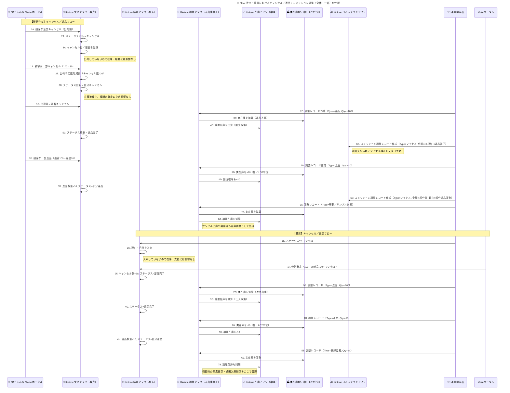

# Flow9: 全体／一部キャンセル・返品

### 🎯 Mục tiêu

Mô tả quy trình xử lý các tình huống **hủy, trả hàng (toàn phần / một phần)** cho cả đơn bán (Order) và đơn mua (PO), bao gồm:

- Quản lý tồn kho logic & vật lý thông qua **Adjustment_App**
- Cập nhật trạng thái đơn hàng / đơn mua
- Điều chỉnh hoa hồng (commission) thủ công khi đã phát sinh chi trả ở kỳ trước
- Hợp nhất toàn bộ xử lý hoàn – hủy – trả hàng trong một quy trình duy nhất, dễ vận hành và kiểm soát

Mục tiêu là đảm bảo dữ liệu tồn kho, đơn hàng và hoa hồng **luôn khớp** nhau mà không cần logic phức tạp hoặc automation Ruby ở giai đoạn MVP.

---

### 🧩 Thành phần hệ thống liên quan

| Thành phần | Vai trò |
| --- | --- |
| **Orders_App (受注アプリ)** | Quản lý thông tin đơn bán, trạng thái, số lượng, lý do hủy/trả |
| **PO_App (購買アプリ)** | Quản lý đơn mua hàng, số lượng nhập và tình trạng hủy/trả |
| **Adjustment_App (調整アプリ)** | Ghi nhận các nghiệp vụ điều chỉnh kho (返品・廃棄・サンプル・棚卸差異) |
| **Stock_App (在庫アプリ)** | Theo dõi tồn kho logic, cập nhật khi có điều chỉnh |
| **Physical_Stock_app (実在庫DB)** | Quản lý tồn kho vật lý chi tiết theo棚 (kệ) và LOT番号 |
| **Commission_App (コミッションアプリ)** | Quản lý và điều chỉnh hoa hồng thủ công sau khi hoàn/trả |
| **Op_Staff (運用担当者)** | Nhân viên vận hành thực hiện điều chỉnh bằng tay trong các app |
| **EC_Channel / Mekaポータル** | Nơi khách hàng / nhà cung cấp thực hiện mua, hủy hoặc trả hàng |

---

### ⚙️ Quy trình tổng thể

### ① Đơn bán (Sales Order)

| Trường hợp | Hành động | Ảnh hưởng | Ghi chú |
| --- | --- | --- | --- |
| **Hủy toàn phần – Chưa xuất kho** | Cập nhật `Status = キャンセル` trong Orders_App | Không ảnh hưởng kho | Lưu ngày & lý do |
| **Hủy một phần – Chưa xuất kho** | Cập nhật `キャンセル数量`, `Status = 部分キャンセル` | Không ảnh hưởng kho | Giữ nguyên phần còn lại |
| **Hủy toàn phần – Đã xuất kho** | Tạo record trong Adjustment_App `Type=返品`, `Qty=+Số lượng` | Cộng lại tồn kho logic + vật lý | `Reason = 出荷後キャンセル` |
| **Hủy một phần – Đã xuất kho** | Adjustment_App `Type=返品`, `Qty=+phần hủy` | Cộng lại tồn tương ứng | `Reason = 部分返品` |
| **Xuất mẫu / Hủy hàng / Sử dụng nội bộ** | Adjustment_App `Type=廃棄／サンプル出庫` | Giảm tồn kho logic + vật lý | Không liên quan commission |

### ➕ Điều chỉnh hoa hồng (Commission)

Nếu đơn hàng đã được tính hoặc trả commission, khi phát sinh hoàn/trả:

- Nhân viên vận hành mở **Commission_App** và tạo bản ghi điều chỉnh thủ công:
    - `Type = 調整(マイナス)`
    - `金額 = -Hoa hồng đã trả`
    - `Reason = キャンセル補正／返品補正`
    - `次回期適用 = true`
- Nếu có phát sinh cộng thêm (ví dụ đổi hàng hoặc mua bổ sung):
    - `Type = 調整(プラス)`
    - `金額 = +Phần bổ sung`
    - `Reason = 交換対応／追加入庫`
- Tất cả record điều chỉnh sẽ được phản ánh ở kỳ chi trả kế tiếp.

---

### ② Đơn mua (Purchase Order)

| Trường hợp | Hành động | Ảnh hưởng | Ghi chú |
| --- | --- | --- | --- |
| **Hủy toàn phần – Chưa nhập kho** | Cập nhật `Status = キャンセル` | Không ảnh hưởng kho | Lưu ngày & lý do |
| **Hủy một phần – Chưa nhập kho** | Cập nhật `入庫予定数` hoặc `キャンセル数量` | Không ảnh hưởng kho | Giữ nguyên phần còn lại |
| **Trả toàn phần – Sau khi nhập kho** | Tạo record trong Adjustment_App `Type=返品`, `Qty=-Số lượng` | Giảm tồn kho logic + vật lý | `Reason = 不良返品` |
| **Trả một phần – Sau khi nhập kho** | Adjustment_App `Type=返品`, `Qty=-phần trả` | Giảm tương ứng | `Reason = 一部返品` |
| **Sai lệch tồn kho / Kiểm kê** | Adjustment_App `Type=棚卸差異`, `Qty=±X` | Điều chỉnh tồn kho vật lý & logic | `Reason = 棚卸修正` |

### 🔄 Luồng hoạt động tổng quát

---