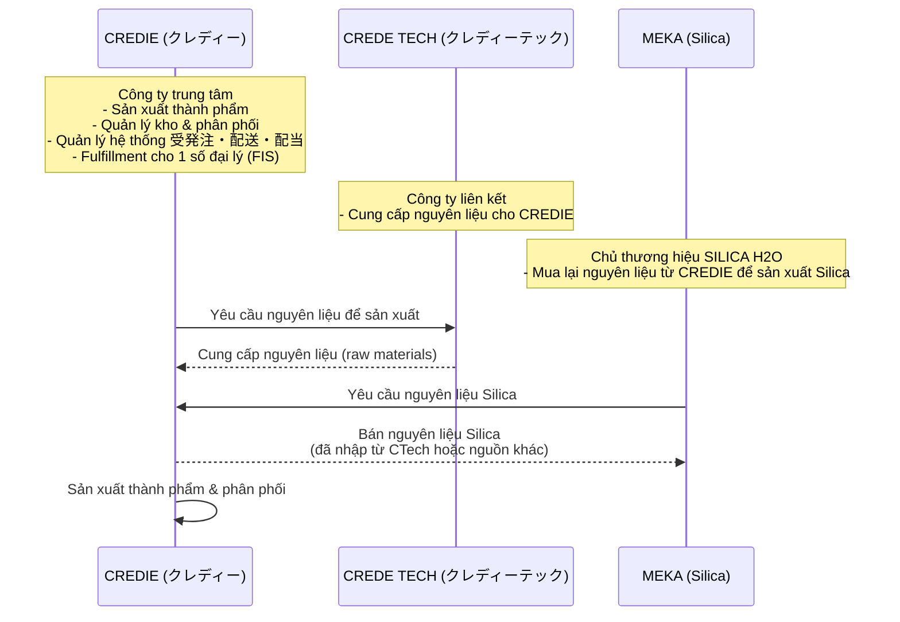

# User hearing info

# **📚**Hiện trạng kinh doanh và đối tác của CREDIE (Bộ phận kinh doanh)


## **📌 Hiện trạng kinh doanh của CREDIE**

1. **Sản phẩm & thương hiệu**
    - CREDIE nhập **nguyên liệu** → sản xuất thành phẩm → bán ra **dưới thương hiệu SILICA**.
2. **Kênh bán hàng EC (BtoC)**
    - Hiện có **2 shop EC** trực tiếp (Shopify). 1 shop là ある生活 do CREDIE vận hành và 1 shop beauty silica do FIS/đại lí vận hanh
    - Đây là nơi bán hàng trực tiếp cho end-user.
3. **Đại lý (BtoB)**
    - Có **7–8 đại lý** tiêu thụ tổng hơn 1,000 sản phẩm/tháng.
    - Trong đó có **1 đại lý lớn là FIS**:
        - FIS có **Shopify shop riêng** để bán BtoC.
        - Nhưng **FIS không tự giao hàng**, mà nhờ **CREDIE giao hộ**.
        - FIS trả cho CREDIE:
            - Phí giao hàng (shipping fee).
            - Phí lưu kho (warehouse fee).
    - Các đại lý khác & OEM (cũng giống đại lý) → **tự lo giao hàng**:
        - Khi order, hàng được chuyển bulk đến kho đại lý/OEM.
        - Không cần CREDIE giao hộ.
4. **Affiliate (取次店)**
    - Với affiliate, họ chỉ cần share link → khách mua ngay trên **Shopify chính của CREDIE**.
    - Commission (報酬) được tính trực tiếp từ order đó.

## **📌 Về kho vận**

- Hiện tại chỉ có **1 kho duy nhất** (尼崎).
- Tất cả đơn hàng (CREDIE shop & FIS) đều xuất từ kho này.
- Trong tương lai: sẽ có thêm **kho thứ 2 (岐阜)** → cần phân tách SKU nào ship từ kho nào (tự động bằng route_rule).

Hiện tại vận hành có 2 kho là kho chính và kho kí gửi **Marusho**

### 🏭 **Kho nội bộ CREDIE**

**Tài liệu/資材:**

- Phần lớn các **ボトル** (chai), **キャップ** (nắp), **ラベル** (nhãn) được lưu tại kho chính
- **段ボール** (thùng carton) các loại size
- Một số tài liệu có ghi chú **"0 丸正在庫"** - nghĩa là không còn trong kho Marusho, chỉ còn ở kho chính

**Nguyên liệu/原料:**

- **イノシトール** (Inositol): Lưu tại kho chính, có LOT và ngày sản xuất
- **田七人参** (Nhân sâm): Kho chính với thông tin LOT chi tiết
- **シリカ粉末・液体**: Các loại Silica ở kho chính

## 🚛 **Kho Marusho (丸正運送)**

Có **hệ thống mã hóa chi tiết:**

**Tài liệu lưu kho:**

- **B-01 → B-15**: 400ml Pauch (600 cái/thùng)
- **D-01 → D-03**: 500ml Pauch + Cap set (600 cái)
- **E-01 → E-03**: 1L Pauch trắng (300 cái)
- **F-01 → F-10**: 1L Pauch chưa gia công (bạc)
- **G-01 → G-22**: 100mL Bottle (550 chai/thùng)
- **H-01 → H-03**: 100mL 中栓 (nút trong)
- **I-01 → I-09**: 100mL キャップ (nắp)
- **L-01 → L-05**: AL 300mL Bottle
- **M-01, M-02**: AL Trigger

**Sản phẩm hoàn thiện:**

- **Q-1 → Q-25**: FEEASY 1L (20 chai/thùng)
- **R-5 → R-20**: pipimerry P-silica (54 chai/thùng)
- **S-1 → S-23**: Dr's Power Rice Silica PREMIUM (dạng bán thành phẩm)

📋 **Nguyên tắc phân bổ:**

- **Kho chính**: Nguyên liệu, tài liệu sử dụng thường xuyên
- **Kho Marusho**: Tài liệu dự trữ lớn, sản phẩm hoàn thiện chờ xuất khẩu
- **Rotation**: Có thể di chuyển giữa 2 kho (VD: một số item ghi "丸正在庫 0" nghĩa là đã chuyển về kho chính)

## **📌 Định nghĩa vai trò**

- **CREDIE**: sản xuất, giữ kho, phân phối, quản lý hệ thống, và đôi khi làm dịch vụ **配送代行 (fulfillment service: FBM)**.
- **Đại lý thường/OEM**: nhập hàng, tự lo phân phối.
- **FIS**: đặc biệt → tuy là đại lý nhưng bán BtoC qua Shopify riêng, nhờ CREDIE fulfillment.
- **Affiliate (取次店)**: chỉ giới thiệu, không quản lý shop, commission được track qua Shopify chính.
    
    👉 Như vậy:
    
    - Hiện tại hệ thống cần cover **EC trực tiếp (2 shop)** + **Fulfillment cho FIS** + **affiliate tracking**.
    - Các đại lý khác và OEM chưa cần flow 配送代行.
    - Sau này nếu có thêm “đại lý kiểu FIS” → cũng sẽ đi qua Shopify riêng của họ + CREDIE fulfillment.

## **📌 Cách vận hành kho & giao hàng hiện tại**

1. **Kho A (尼崎)**
    - Hiện tại **tất cả đơn hàng** đều ship từ kho A.
    - **Ship&Co** được sử dụng để phát hành **送り状 (shipping label)**.
    - Trong label, **ship_from luôn luôn là kho A**.
    - **CREDIE đã ký hợp đồng** với công ty vận chuyển là **Yamato** và **佐川 (Sagawa)**.
    - Khi có đơn hàng:
        - Staff CREDIE tải **CSV đơn hàng** từ các EC site → Login vào Ship&Co tạo vận đơn.
        - **In vận đơn & đóng gói**
            - Staff in vận đơn dán lên thùng hàng.
            - Đóng gói sản phẩm theo order.
        
               **Hãng vận chuyển pickup**
        
        - Ship&Co tự động quyết định Yamato hay Sagawa (thường theo rule “khoảng cách gần hơn” hoặc “chi phí rẻ hơn”).
        - Hãng vận chuyển (Yamato/Sagawa) tới kho A pickup hàng → giao cho khách.
2. **Kho B (岐阜, dự kiến tháng 11)**
    - Sau này sẽ vận hành thêm kho B.
    - Trước khi đi vào hoạt động, **CREDIE phải ký hợp đồng vận chuyển riêng** (với Yamato/Sagawa khu vực Gifu).
    - Về cơ bản luồng sẽ **giống hệt kho A**:
        - Ship&Co sẽ thêm 1 profile cho **kho B**.
        - Khi order có SKU map → ship_from = B, Ship&Co in label với địa chỉ kho B.
        - Yamato/Sagawa sẽ pickup tại kho B.
        - 

### **📌 Cách tính giá cho đại lý**

1. **Mỗi đại lý (代理店)** có một **tỷ lệ giảm giá riêng (掛け率)**.
    - Ví dụ:
        - Đại lý A = 80% (tức -20% so với giá list).
        - Đại lý B = 70% (tức -30%).
    - Tỷ lệ này áp dụng cho **toàn bộ sản phẩm**, không phân biệt SKU.
2. **Khi đại lý order** (qua BtoB Portal hoặc nhập đơn hộ):
    - Hệ thống lấy **giá list (list price)** của sản phẩm.
    - Nhân với **掛け率** của đại lý.
    - → Kết quả là **giá order của đại lý**.
3. **Đặc điểm**:
    - Không cần lưu discount theo từng sản phẩm.
    - Chỉ cần quản lý **Agent Master** với field: discount_rate.
    - Khi phát sinh invoice → áp đúng discount_rate của agent đó.
    


## **📌** 配当(cổ đông)

- Cái mà khách gọi là **配当 (haitou)** ở đây **không phải cổ tức cho cổ đông** theo nghĩa kế toán.
- Nó thực chất là **rebate / commission trả cho partner** dựa trên số lượng sản phẩm bán được.
- Dùng từ “配当”, nhưng bản chất là **tiền thưởng theo sản lượng bán hàng** (giống **hoa hồng khuyến khích**).
    
    ### **📌 Vì sao chắc chắn là rebate?**
    
    1. Trong requirement đã ghi rõ:
        - MWATER = 2円 /本 cố định.
        - SILICA = 5円 → sau khi cumulative ≥ 5,000万 thì còn 3円.
        - Tính theo **本数 bán ra** chứ không phải lợi nhuận kế toán.
    2. Trong hệ thống,配当 được quản lý trong **Dividend Dashboard**, chỉ ghi nhận:
        - Số lượng bán.
        - Đơn giá rebate.
        - Tổng rebate.
        - Lock dữ liệu theo quý.

### **📌 Vậy hiểu đúng:**

- **配当 trong hệ thống này = rebate cho partner/đại lý**,
    
    là khoản incentive trả theo số lượng đơn hàng bán được.
    
- Nó chỉ **giống tên “配当”** nhưng bản chất là **販売インセンティブ**.
    
    ```mermaid
    sequenceDiagram
        participant Partner as Partner/Đại lý
        participant System as Hệ thống
        participant Dashboard as Dividend Dashboard
    
        Partner->>System: Bán sản phẩm
        System->>System: Ghi nhận số lượng bán
        System->>System: Xác định loại sản phẩm
        alt Sản phẩm = MWATER
            System->>System: rebate = 2円 × số lượng
        else Sản phẩm = SILICA
            alt cumulative < 5,000万
                System->>System: rebate = 5円 × số lượng
            else cumulative ≥ 5,000万
                System->>System: rebate = 3円 × số lượng
            end
        end
        System->>Dashboard: Cập nhật rebate (số lượng, đơn giá, tổng)
        Dashboard-->>System: Lưu dữ liệu
        System->>Dashboard: Lock dữ liệu theo quý
    ```
    

## **📌 Quan hệ các công ty liên quan**

1. **CREDIE (クレディー)**
    - Công ty trung tâm (khách hàng order phát triển hệ thống lần này).
    - Vai trò: sản xuất thành phẩm, giữ kho, phân phối, quản lý hệ thống受発注・配送・配当.
    - Đồng thời làm **配送代行 (fulfillment)** cho một số đại lý đặc biệt (như FIS).
2. **CREDE TECH (クレディーテック)**
    - Công ty liên quan (liên kết với CREDIE).
    - Vai trò: cung cấp **nguyên liệu** (raw materials) để CREDIE sản xuất sản phẩm.
    - Khi cần sản xuất thêm, CREDIE nhập nguyên liệu từ CREDE TECH.
3. **MEKA (Silica)**
    - Công ty đứng sau thương hiệu **SILICA H2O**.
    - Khi cần nhập nguyên liệu để sản xuất sản phẩm Silica, MEKA cũng mua lại từ CREDIE, mà nguyên liệu đó CREDIE đã nhập từ CREDE TECH (hoặc các nguồn khác).



## **📌 Chuỗi cung ứng (supply chain) tóm tắt**

- **CREDE TECH** → cung cấp nguyên liệu.
- **CREDIE** → nhập nguyên liệu, sản xuất sản phẩm (MWATER / SILICA thành phẩm), lưu kho, phân phối.
- **MEKA (Silica)** → thương hiệu Silica, khi cần nguyên liệu cũng nhập qua CREDIE.
- **FIS, đại lý, OEM** → nhập thành phẩm để bán BtoC/BtoB.
- **End-user** → mua qua EC site (Shopify, Rakuten, Amazon) hoặc qua đại lý.

👉 Nói cách khác:

- CREDIE = hub trung tâm: vừa nhập nguyên liệu (từ CREDE TECH), vừa sản xuất, vừa phân phối thành phẩm cho các brand (Silica/MWATER) và đại lý.
- MEKA = brand Silica, nhưng nguyên liệu để sản xuất vẫn qua CREDIE.

## **📌 Quy tắc chịu phí giao hàng (Shipping Fee)**

1. **End-user (BtoC trên Shopify / Rakuten / Amazon)**
    - **Phí ship do end-user (khách mua) trả.**
    - Thu trực tiếp khi checkout.
    
2. **Đại lý (代理店) & OEM (法人注文 / BtoB)**
    - **Phí ship do CREDIE chịu.**
    - Nghĩa là CREDIE xuất hàng bulk (nguyên kiện) tới kho/địa điểm của đại lý hoặc OEM, không tính thêm phí vận chuyển cho họ.
    - Trừ trường hợp đặc biệt như FIS (bán BtoC và nhờ CREDIE fulfillment) thì phí ship + phí lưu kho do **FIS trả cho CREDIE**.

## **📌 Quy tắc xử lý đơn hàng theo đối tượng**

### **1. BtoC (Shopify / Rakuten / Amazon)**

- **Hết hàng (Out of stock)** → không cho checkout.
- User chỉ mua được khi còn tồn kho thực tế.
- Thanh toán online như bình thường (credit card, bank, v.v.).
- Không có backorder cho end-user.

### **2.Đại lý (代理店) / OEM**

- **Cho phép order vượt quá tồn kho** (backorder).
- Nếu tồn kho hiện tại không đủ:
    - Ví dụ order 1000, kho chỉ còn 500.
    - CREDIE giao 500 trước.
    - Đại lý **thanh toán trước 500 sản phẩm này** (必ず前払い).
    - Sau đó, khi bổ sung hàng → giao tiếp 500 còn lại.
    - Đại lý sẽ thanh toán tiếp phần đó trước khi giao.
- Tức là order có thể split thành nhiều lần giao hàng + nhiều lần thanh toán.
    
    ### **📌 Implication cho hệ thống**
    
    - **Orders App (Kintone)** cần support trạng thái:
        - partial shipped (giao 1 phần).
        - backorder pending (chờ hàng bổ sung).
    - **Thanh toán**: phải link với số lượng giao thực tế, không phải số lượng order toàn bộ.
    - **BtoC flow** và **BtoB flow** khác nhau rõ rệt:
        - BtoC = hard stop khi hết hàng.
        - BtoB = cho phép backorder, split shipment, split payment.
    
    ```mermaid
    sequenceDiagram
        participant Agent as Đại lý (代理店/OEM)
        participant Orders as Orders App (Kintone)
        participant Credie as CREDIE (Kho & Fulfillment)
        participant Payment as Thanh toán
    
        Agent->>Orders: Tạo order (ví dụ: 1000 sản phẩm)
        Orders->>Credie: Kiểm tra tồn kho
        Credie-->>Orders: Tồn kho hiện tại = 500
    
        alt Tồn kho không đủ
            Orders->>Credie: Tạo shipment đầu tiên (500 sp)
            Orders->>Orders: Set trạng thái = partial shipped
            Credie->>Agent: Giao 500 sản phẩm
            Agent->>Payment: Thanh toán trước 500 sản phẩm
            Payment-->>Credie: Xác nhận đã nhận tiền
    
            Orders->>Orders: Set backorder pending (500 sp còn lại)
            Credie->>Credie: Bổ sung sản xuất/kho
            Credie->>Orders: Thông báo hàng đã sẵn sàng
            Orders->>Credie: Tạo shipment tiếp theo (500 sp)
            Credie->>Agent: Giao 500 sản phẩm còn lại
            Agent->>Payment: Thanh toán tiếp 500 sản phẩm
            Payment-->>Credie: Xác nhận đã nhận tiền
        end
    
        Note over Orders: Orders App cần support trạng thái:<br/>- partial shipped<br/>- backorder pending
        Note over Orders: Thanh toán phải link với số lượng giao thực tế,<br/>không phải toàn bộ order
    
    ```
    

## **📌 Đặc điểm 2 kho của CREDIE**

### **🏭 Kho A（尼崎倉庫）**

- **Nằm ngay cạnh văn phòng chính của CREDIE** → thuận tiện cho quản lý & vận hành.
- **Quy mô lớn** (rộng).
- Vừa **sản xuất** vừa **lưu kho**.
- Lưu trữ **đa dạng sản phẩm** (không chỉ nước).
- Hiện tại: **tất cả đơn hàng** đều xuất từ kho này.
- Ship&Co đang được cấu hình với **Shipper Profile = Kho A**.
- Đã ký hợp đồng vận chuyển với **Yamato** & **佐川 (Sagawa)**.

### **🏢 Kho B（岐阜倉庫, dự kiến tháng 11）**

- **Quy mô nhỏ hơn**, chủ yếu để **lưu trữ nước (MWATER, SILICA H2O)**.
- Không có dây chuyền sản xuất, chỉ làm nhiệm vụ **fulfillment**.
- Cần ký hợp đồng vận chuyển mới với Yamato/Sagawa khu vực Gifu.
- Khi đưa vào vận hành:
    - Các SKU “nước” sẽ được **route trực tiếp từ kho B**.
    - Hệ thống cần field route_rule trong Products Master để xác định **ship_from = A or B**.
    - Ship&Co phải cấu hình thêm một **Shipper Profile riêng cho kho B**.

---

👉 Như vậy:

- **Kho A** = Trung tâm chính (đa sản phẩm, sản xuất + lưu kho, ngay cạnh văn phòng CREDIE).
- **Kho B** = Kho phụ (chỉ nước, fulfillment nhỏ, độc lập với hợp đồng vận chuyển).


Nội dung cần xác nhận ở cuộc họp tiếp theo 2025/09/28

# **📚 Cấu tạo sản phẩm & cách quản lý (Bộ phận sản xuất)**

## Sản phẩm

### OEM・資材 và quản lý tồn kho — điểm cần xác nhận

- 資材 dành riêng cho OEM: một số 資材 được OEM đặt mua từ Credie để họ tự sản xuất sản phẩm của họ.
    - Ví dụ OEM: 二チジン là công ty OEM, đặt hàng nguyên liệu/資材 từ Credie.
- Quản lý tồn kho cho OEM: cần xác nhận liệu nguyên liệu tồn kho dành cho OEM có phải quản lý tách biệt theo từng OEM hay không.
- 入数/cs: cần xác nhận đây có phải là số lượng tối thiểu khi đặt hàng hay chỉ là quy cách đóng gói theo case/carton.
- Quản lý vị trí tồn: nguyên liệu và thành phẩm cần quản lý tới cấp棚 (kệ), kho nào. Dự kiến dùng barcode để xuất nhập, kiểm kê, và truy vết di chuyển.
- 仕掛け品名: có loại sản phẩm đang sản xuất dở dang. Cần xác nhận có quản lý riêng nguyên liệu tồn kho dành cho 仕掛け品 hoặc theo batch WIP không.
- Kho ký gửi Marusho: cần xác nhận mức độ cần thiết và phạm vi vận hành của kho ký gửi này trong tương lai.
- Credie có 2 nhóm sản phẩm: **nước** và **ngoài nước** (không chỉ riêng mỹ phẩm).
- Dự kiến có **nhà máy sản xuất nước đóng chai** đi vào hoạt động vào **tháng 11** sắp tới.
- Để sản xuất thành phẩm nước cần **BOM** dựa trên hai nhóm: **資材 (vật tư/bao bì)** và **材料 (nguyên liệu)**.
- Hiện tại khách hàng **chưa quản lý BOM**. Đang **xin tài liệu cấu thành BOM** từ phía khách để chuẩn hóa vào hệ thống.
- Hành động tiếp theo: chuẩn bị **mẫu cấu trúc BOM** cho sản phẩm nước để khách điền, sau đó nhập vào BOM App.

## Ví dụ về cấu tạo 1 sản phẩm nước

Giả sử sản phẩm cuối cùng (**thành phẩm**) là:

👉 **1 chai nước uống Silica 500ml**

Để sản xuất ra **1 chai nước này**, Credie cần chuẩn bị các **nguyên liệu (Material)** như sau:

- **1 cái chai nhựa 500ml (PET bottle)**
- **1 cái nắp chai**
- **1 cái nhãn dán**
- **0.5 lít nước Silica nguyên liệu**

Trong hệ thống, phần **BOM (部材表)** sẽ định nghĩa mối quan hệ:

> 1 chai nước Silica 500ml = 1 chai PET + 1 nắp + 1 nhãn + 0.5 lít nước
> 

Khi có **order 1,000 chai**, hệ thống sẽ tự động tra BOM để tính ra số nguyên liệu cần xuất kho:

- 1,000 chai PET
- 1,000 nắp
- 1,000 nhãn
- 500 lít nước Silica

Giả sử sản phẩm cuối cùng (**thành phẩm**) là:

👉 **1 chai nước uống Silica 500ml**

Để sản xuất ra **1 chai nước này**, Credie cần chuẩn bị các **nguyên liệu (Material)** như sau:

- **1 cái chai nhựa 500ml (PET bottle) (資材）**
- **1 cái nắp chai (資材）**
- **1 cái nhãn dán (資材）**
- **0.5 lít nước Silica nguyên liệu (材料）**

Trong hệ thống, phần **BOM (部材表)** sẽ định nghĩa mối quan hệ:

> 1 chai nước Silica 500ml = 1 chai PET + 1 nắp + 1 nhãn + 0.5 lít nước
> 

Khi có **order 1,000 chai**, hệ thống sẽ tự động tra BOM để tính ra số nguyên liệu cần xuất kho:

- 1,000 chai PET
- 1,000 nắp
- 1,000 nhãn
- 500 lít nước Silica

## Mỗi quan hệ giữa các thành phần cấu tạo nên sản phẩm

- **Products ↔ BOM ↔ Materials**: quản lý thành phẩm và cấu thành BOM từ nguyên liệu.
- **Orders ↔ Products ↔ Stock Movements ↔ Stock**: quản lý đơn hàng, xuất kho và tồn kho.
- **Materials ↔ Suppliers ↔ Purchase Orders**: quản lý luồng mua nguyên liệu.

# **📚 Quy trình sản xuất của Credie (Bộ phận sản xuất)**

## 1. Các loại sản phẩm do credie tự sản xuất

### **1.Sản xuất nước uống**

- Chắc chắn Credie có **tự sản xuất**:
    - Họ nhập nguyên liệu (chai, nắp, nhãn…) → kết hợp thành thành phẩm (nước uống).
    - Có file quản lý BOM và tồn kho nguyên liệu.
    - Kho A vừa là **nơi sản xuất** vừa là **nơi lưu kho** nước.

### **2.Mỹ phẩm (hiện tại là mỹ phẩm, sau này còn nhiều sản phẩm khác, gọi chung là ngoài Nước)**

- Với mỹ phẩm, trong file có tab:
    - **化粧品（クレディー倉庫内）在庫表** (tồn kho mỹ phẩm trong kho Credie).
    - **サンプル化粧品・パック在庫表** (tồn kho sample).
- Điều này cho thấy Credie **đang quản lý mỹ phẩm giống như thành phẩm nhập kho**, nhưng **không có dấu hiệu BOM hay quản lý nguyên liệu để sản xuất mỹ phẩm**.
- Có thể:
    - Credie **không trực tiếp sản xuất mỹ phẩm**, mà nhập từ OEM/nhà sản xuất khác → chỉ quản lý tồn kho & phân phối.
    - Việc này khác với nước, vì nước có BOM và nguyên liệu.

## 2. Cập nhật thực tế vận hành sản xuất (2025-09-29)

- Quy trình hiện tại khá đơn giản, **không có kế hoạch sản xuất cố định**. Khi thấy cần sản xuất là tiến hành, hoạt động sản xuất diễn ra **hàng ngày**.
- Nhân sự sản xuất thường trực: **khoảng 5–7 người**. Khi khối lượng đơn hàng tăng đột biến sẽ **thuê thêm part-time** để đẩy nhanh tiến độ.
- Ba thao tác chính của nhân viên sản xuất:
    1. **Giảm kho nguyên liệu** đã sử dụng cho sản xuất.
    2. **Tăng kho thành phẩm** sau khi hoàn thành sản xuất.
    3. **Phát hành yêu cầu mua (order) nguyên liệu** khi kho xuống dưới ngưỡng hoặc hết hàng.

# **📚Vai trò nhân viên trong Credie (Bộ phận vận hành)**

## **1. Nhân viên kho (倉庫担当)**

- Phạm vi thao tác: **chỉ thực hiện xuất nhập kho** và **scan barcode** để ghi nhận di chuyển hàng hóa.
- Khi xuất kho KHÔNG gắn với đơn bán (ví dụ hỏng hóc, lỗi, dùng nội bộ, xuất mẫu), bắt buộc **chọn và ghi lý do xuất kho**.
    - Lý do gợi ý: lỗi hỏng, thất lạc, xuất mẫu, kiểm định, dùng nội bộ, khác.
- Khi nhập kho: scan mã vị trí kệ (棚) và mã hàng để ghi nhận chính xác vị trí tồn.
- Quy trình xuất kho chuẩn hóa (gợi ý):
    1. Tạo picking list từ đơn hàng hoặc phiếu xuất nội bộ.
    2. Xác nhận vị trí kệ (棚) và LOT của sản phẩm cần lấy.
    3. Scan barcode vị trí kệ và barcode sản phẩm, lấy hàng ra khỏi kệ.
    4. Kiểm đếm số lượng thực lấy. Nếu không gắn đơn bán, chọn và ghi lý do xuất kho.
    5. Xác nhận xuất kho trên hệ thống, in chứng từ cần thiết nếu có.
    6. Hệ thống cập nhật tồn kho và ghi Stock Movement để truy vết.
- Nhận hàng nguyên vật liệu từ supplier, kiểm đếm và nhập kho.
- Quản lý tồn kho thành phẩm + nguyên liệu (chai, nắp, nhãn, nước thô, mỹ phẩm nhập về).
- Xuất kho khi có đơn hàng (scan barcode chai + vị trí kệ).
- Quản lý việc xuất mẫu (営業サンプル) và điều chỉnh tồn kho.

## **2. Nhân viên sản xuất (製造担当)**

- Theo dõi BOM (chai, nắp, nhãn, nước).
- Ghi nhận lượng nguyên liệu đã sử dụng cho mỗi batch sản xuất.
- Bàn giao thành phẩm cho kho → cập nhật vào tồn kho thành phẩm.

## **3. Nhân viên đơn hàng (受注担当)**

- Tiếp nhận đơn BtoB từ đại lý qua mail/FAX, nhập tay vào hệ thống.
- Theo dõi đơn từ EC (Shopify, FIS shop) đồng bộ về Kintone qua Yoom.
- Kiểm tra tình trạng đơn hàng (Paid / Unpaid).

      Sau khi nhận được tiền thanh toán từ Agency xong thì mới giao hàng và cần phát hàng 請求書

- Liên hệ với kho để sắp xếp giao hàng.

## **4. Nhân viên giao vận / vận chuyển (配送担当)**

- Phát hành **送り状** trên Ship&Co (trước đây bằng CSV upload).
- Hiện tại chỉ BtoC là Ship&Co, còn BtoB là tự in và viết 送り状 bằng tay (định hướng số hóa lần này sẽ chuyển sang dùng Ship&Co hết)
- Liên hệ Yamato / 佐川 để đến kho lấy hàng (sau nay cũng tự động)
- Xác nhận tracking_no và gửi lại thông tin cho khách (sau này cũng cập nhập tự động bằng API)

## **5. Nhân viên mua hàng (購買担当)**

- Theo dõi tồn kho nguyên liệu (資材).
- Khi dưới ReorderPoint → phát hành 発注書 và liên hệ supplier.
- Sau khi thanh toán cho Meka xong thì mới chinh thức order (前払い)
- cần phát hành 支払書
- Quản lý thời gian giao hàng (納期) và phối hợp kiểm hàng khi nhập.

## **6. Nhân viên kế toán / tài chính (経理担当)**

- Kiểm tra đối soát thanh toán từ đại lý (ngân hàng).
- Quản lý chi trả 配当 (rebate/dividend) và hoa hồng affiliate.
配当と取次点：サイクル:請求書, 領収書

## **7. Nhân viên kinh doanh / sales (営業担当) → không có**

- Liên hệ đại lý, theo dõi rank và ưu đãi cho đại lý.
- Quản lý affiliate (取次店) → phát hành link giới thiệu. (hiện tại đang là đại lí, nhưng vì số lượng sản phẩm lớn thì thành affilate)
- Ghi nhận việc xuất hàng mẫu cho khách hàng tiềm năng.

## 8. Quản lí dòng tiền xuất nhập (入出金）→ 不要