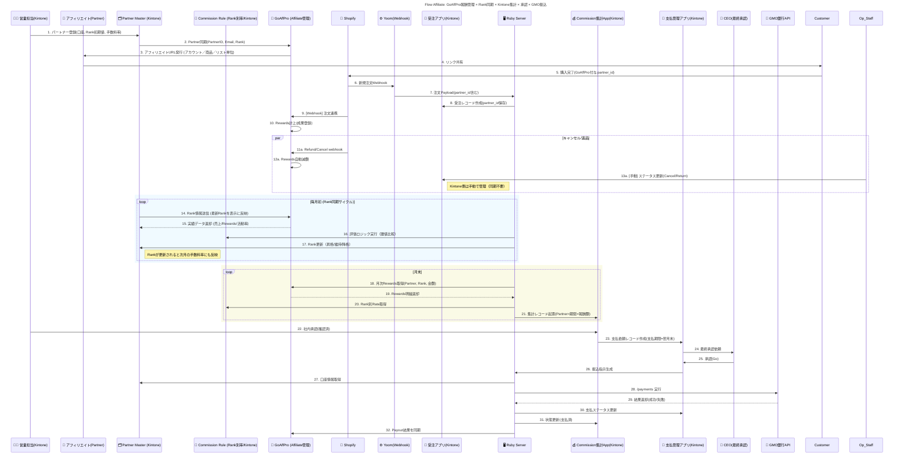

# System Flow 3: GoAffPro連携によるアフィリエイト報酬処理

## Mục tiêu

Mục tiêu của flow này là quản lý toàn bộ chu trình **Affiliate Commission** thông qua việc tích hợp giữa:

- **GoAffPro** (quản lý rewards thực tế & hiển thị dashboard cho affiliate)
- **Kintone** (quản lý Partner, Rank, Rule, Commission và Payment)
- **Ruby Server** (middleware thực hiện logic xử lý batch)
- **GMO API** (chuyển khoản ngân hàng)

Hệ thống phải đảm bảo:

1. Rewards trên GoAffPro luôn phản ánh đúng Rank hiện tại của affiliate
2. Commission và Payment được tổng hợp, phê duyệt, và chuyển khoản minh bạch hàng tháng
3. Trạng thái thanh toán được đồng bộ ngược lại giữa GoAffPro và Kintone
4. Rank được đánh giá lại tự động mỗi tháng dựa trên doanh số thực tế

## Thành phần Hệ thống

| Thành phần | Mô tả |
| --- | --- |
| **GoAffPro** | Hệ thống quản lý affiliate, reward và rank thực tế |
| **Partner_App (Kintone)** | Quản lý thông tin affiliate, tài khoản ngân hàng, Rank hiện tại |
| **Rule_App (Kintone)** | Lưu bảng quy tắc hoa hồng theo từng Rank (Rank-based Commission Rule) |
| **Orders_App (Kintone)** | Ghi nhận đơn hàng và trạng thái thanh toán, hủy hoặc trả hàng |
| **Commission_App (Kintone)** | Tổng hợp commission cuối kỳ, phê duyệt nội bộ |
| **Payments_App (Kintone)** | Quản lý thông tin chuyển khoản (Payment Request / Payment Status) |
| **Ruby_Server** | Middleware thực hiện logic batch, gọi API GoAffPro & GMO Bank |
| **GMO_API** | API chuyển khoản hàng loạt cho các affiliate |
| **CEO (承認者)** | Phê duyệt cuối cùng trước khi thực hiện chuyển khoản |

## Quy trình Chi tiết

### 1️⃣ Đăng ký và phát hành URL Affiliate

1. Nhân viên sales đăng ký affiliate trong `Partner_App`, bao gồm:
   - Partner ID, Email, Rank khởi tạo (ví dụ: Bronze)
   - Tài khoản ngân hàng

2. `Ruby_Server` đồng bộ dữ liệu sang **GoAffPro** qua API

3. GoAffPro tự động phát hành **Affiliate URL**:
   - URL theo tài khoản (Affiliate Account)
   - URL cho từng sản phẩm (Product Link)
   - URL cho danh sách sản phẩm (Collection Link)

4. Affiliate (Partner) chia sẻ URL để giới thiệu người mua hàng

---

### 2️⃣ Đơn hàng và ghi nhận Reward

1. Khi người dùng click vào affiliate URL và mua hàng trên Shopify, GoAffPro gắn `partner_id` vào đơn hàng

2. `Yoom` nhận Webhook → gửi sang `Ruby_Server` → tạo record trong `Orders_App`

3. GoAffPro tự động ghi nhận **Reward (Commission)** tương ứng cho affiliate

4. Thông tin đơn hàng, số tiền, Partner ID được lưu trên cả hai hệ thống

---

### 3️⃣ Xử lý Cancel / Return

| Hệ thống | Hành động |
| --- | --- |
| **GoAffPro** | Shopify gửi Webhook về GoAffPro khi có refund hoặc return. GoAffPro tự động trừ reward tương ứng |
| **Kintone** | Nhân viên vận hành cập nhật **Orders_App.status** sang `キャンセル` hoặc `返品` (thủ công) |
| **Ruby_Server** | Khi tổng hợp tháng, Ruby sẽ đối chiếu reward thực tế đã giảm trên GoAffPro để tránh double-count |

> **Lưu ý**: Việc hoàn tiền chỉ ảnh hưởng đến reward thực tế trên GoAffPro, còn trên Kintone chỉ lưu record trạng thái phục vụ cho audit nội bộ.

---

### 4️⃣ Đồng bộ Rank hàng tháng (毎月初)

**Mục tiêu**: Đảm bảo GoAffPro hiển thị đúng Rank hiện tại và Kintone cập nhật Rank mới theo kết quả kỳ trước.

1. `Partner_App` gửi Rank hiện tại của từng Partner lên GoAffPro để hiển thị

2. GoAffPro trả về dữ liệu hoạt động tháng trước:
   - Tổng doanh số
   - Tổng Reward
   - Số lượng đơn hàng
   - Tỉ lệ hoàn trả / hiệu suất

3. `Ruby_Server` thực hiện **logic đánh giá Rank**:
   - So sánh với bảng quy tắc trong `Rule_App` (ví dụ: Silver ≥ ¥500,000)
   - Nếu đạt ngưỡng → tăng Rank
   - Nếu thấp hơn → hạ hoặc giữ nguyên Rank

4. Rank mới được cập nhật vào `Partner_App` → đồng bộ lại sang GoAffPro

**Ví dụ**:
> Partner A đạt ¥2,300,000 → Rank tháng sau tự động lên Gold, và tỉ lệ hoa hồng trên GoAffPro hiển thị tăng từ 7% → 10%.

---

### 5️⃣ Chốt sổ và tổng hợp commission (毎月末)

1. Vào cuối tháng, `Ruby_Server` gọi API GoAffPro để lấy dữ liệu **Rewards tổng** theo Partner

2. Đối chiếu với Rank trong `Rule_App` để xác định tỷ lệ chính xác

3. Ghi record vào `Commission_App` gồm:
   - Partner ID
   - Kỳ tháng
   - Rank hiện tại
   - Tổng Reward (¥)
   - Trạng thái: `下書き`

4. Nhân viên kế toán hoặc sales kiểm tra, xác nhận và chuyển sang `承認済み`

5. Sau khi approve, hệ thống tự động tạo record tương ứng trong `Payments_App` với **hạn thanh toán = cuối tháng kế tiếp**

---

### 6️⃣ Phê duyệt CEO và chuyển khoản GMO

1. `Payments_App` gửi yêu cầu phê duyệt tới CEO

2. Khi CEO approve (`Go`), `Ruby_Server` gọi **GMO API /payments** để thực hiện chuyển khoản:
   - Sử dụng thông tin tài khoản từ `Partner_App`
   - Có thể batch nhiều Partner cùng lúc

3. Nhận kết quả từ GMO (Success / Failed / Fee)

4. Cập nhật:
   - `Payments_App.status` = 支払済み hoặc 失敗
   - `Commission_App.status` = 支払済み
   - Đồng bộ ngược kết quả payout sang GoAffPro để hiển thị cho affiliate

---

## Logic Tính Hoa hồng

| Rank | Doanh số trong kỳ | Tỷ lệ hoa hồng | Ghi chú |
| --- | --- | --- | --- |
| **Bronze** | Dưới ¥500,000 | 5% | Rank khởi tạo |
| **Silver** | ¥500,000–¥2,000,000 | 7% | Tự động tăng khi đạt ngưỡng |
| **Gold** | Trên ¥2,000,000 | 10% | Hạ nếu 2 kỳ liên tiếp không đạt |

**Công thức tính**:
- Commission = Sales × Rate (lấy theo Rank tại thời điểm tính)
- Nếu Reward từ GoAffPro lệch với Rate trong Rule_App, ghi chú cảnh báo trong Commission_App

## Sequence Diagram



## Xử lý Ngoại lệ

| Tình huống | Hành động |
| --- | --- |
| **Cancel / Return** | GoAffPro tự động giảm reward; Kintone cập nhật thủ công trạng thái |
| **Sai lệch Rank / Reward** | Ruby đánh dấu flag "差異あり" trong Commission_App để kế toán kiểm tra |
| **Lỗi chuyển khoản** | Payments_App = 支払失敗; không cập nhật Commission sang 支払済 |
| **Thay đổi Rank đột xuất** | Có thể update thủ công trong Partner_App, GoAffPro sẽ sync lại trong batch kế tiếp |

## Tần suất Xử lý Batch

| Loại batch | Mô tả | Lịch chạy |
| --- | --- | --- |
| **Rank Sync** (GoAffPro ↔ Kintone) | Gửi rank hiện tại & nhận kết quả hiệu suất để đánh giá rank mới | Ngày 1 hàng tháng |
| **Rewards Import** | Lấy dữ liệu rewards theo kỳ từ GoAffPro | Ngày 28–31 hàng tháng |
| **GMO Payment** | Thực hiện chuyển khoản sau khi CEO duyệt | Ngày cuối tháng kế tiếp |

## Trạng thái Commission và Payment

### Commission_App Status

| Trạng thái | Mô tả |
| --- | --- |
| `下書き` | Bản nháp, chưa được kiểm tra |
| `承認済み` | Đã được nhân viên kế toán/sales phê duyệt |
| `支払済み` | Đã chuyển khoản thành công |
| `差異あり` | Có sự khác biệt giữa GoAffPro và Rule_App, cần kiểm tra |

### Payments_App Status

| Trạng thái | Mô tả |
| --- | --- |
| `支払依頼` | Đã tạo yêu cầu thanh toán, chờ CEO duyệt |
| `承認待ち` | Chờ CEO phê duyệt |
| `支払済み` | Đã chuyển khoản thành công qua GMO API |
| `支払失敗` | Chuyển khoản thất bại, cần xử lý lại |

## Sơ đồ Tổng quan Luồng

```
GoAffPro ⇄ Ruby_Server ⇄ Kintone (Partner / Rule / Commission / Payments) ⇄ GMO API
```

### Luồng Dữ liệu Chính

1. **Đăng ký**: Partner_App → GoAffPro (đồng bộ thông tin affiliate)
2. **Đơn hàng**: Shopify → Yoom → Orders_App (ghi nhận partner_id)
3. **Reward**: GoAffPro tự động tính reward
4. **Rank**: Partner_App ↔ GoAffPro (đồng bộ rank hàng tháng)
5. **Commission**: GoAffPro → Commission_App (tổng hợp cuối tháng)
6. **Payment**: Commission_App → Payments_App → GMO API (chuyển khoản)

## Kết quả Mong đợi

- ✅ Affiliate có thể xem **Rank và Reward thực tế** trực tiếp trên GoAffPro Dashboard
- ✅ Kintone quản lý toàn bộ luồng **từ partner → commission → payment**
- ✅ Rank được cập nhật tự động hàng tháng, phản ánh đúng hiệu suất bán hàng
- ✅ CEO có thể duyệt & chuyển khoản qua GMO chỉ trong 1 thao tác
- ✅ Toàn bộ luồng được tự động ghi log, có thể audit chi tiết theo Partner, Rank và kỳ

## Tính năng Đặc biệt

### Rank Tự động Đánh giá
- Hệ thống tự động đánh giá rank dựa trên doanh số tháng trước
- Rank được cập nhật vào đầu tháng, áp dụng cho cả tháng đó
- Có thể hạ rank nếu không đạt ngưỡng 2 kỳ liên tiếp

### Đồng bộ Hai chiều
- Kintone → GoAffPro: Cập nhật rank và thông tin partner
- GoAffPro → Kintone: Nhận dữ liệu reward và hiệu suất

### Batch Processing
- Tất cả các xử lý batch đều chạy tự động theo lịch định kỳ
- Có thể chạy thủ công khi cần thiết
- Log đầy đủ cho mọi batch job

## Liên kết Flow Khác

- **Flow 1**: EC注文の自動取込・在庫引当と出荷処理 (Đơn hàng B2C có thể có partner_id)
- **Flow 2**: B2B 全体プロセス (Đơn hàng B2B có thể có partner_id)
- **Flow 9**: Xử lý Cancel / Return (ảnh hưởng đến reward)

