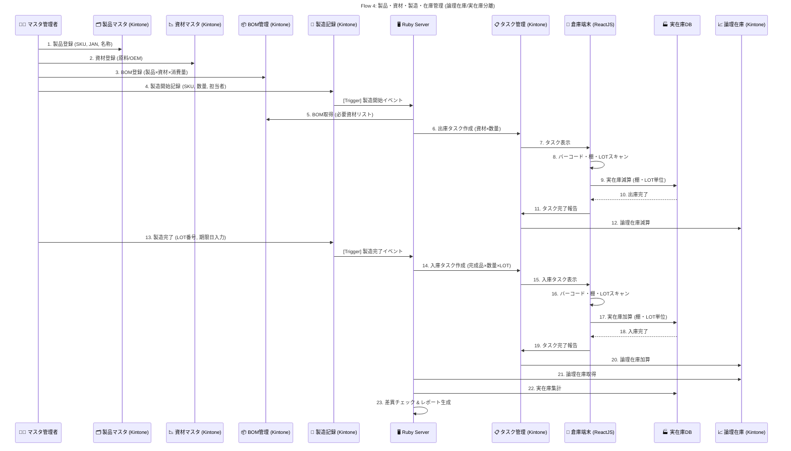

# System Flow 4: 製品・資材・製造・在庫管理フロー

## Mục tiêu

Xây dựng luồng quản lý toàn bộ quy trình sản phẩm – vật tư – BOM – sản xuất – nhập xuất kho trên nền Kintone, tích hợp màn hình quét barcode ReactJS, đảm bảo nhất quán giữa:

- **論理在庫 (Logic Stock)** – tồn kho hệ thống
- **実在庫 (Physical Stock)** – tồn kho thực tế theo từng **kệ (Location)** và **LOT番号**
- Không sử dụng WMS bên ngoài, barcode do **nhân viên tự in bên ngoài hệ thống**

## Thành phần Hệ thống

| Thành phần | Vai trò |
| --- | --- |
| 👨‍💻 **Master_Admin** | Người vận hành, quản lý CRUD master & ghi nhận sản xuất |
| 🗂️ **Product_App** | App quản lý sản phẩm (SKU, tên, quy cách, đơn vị, JAN code) |
| 📉 **Material_App** | App quản lý vật tư/nguyên liệu |
| 📦 **BOM_App** | App quản lý định mức vật tư cho từng sản phẩm |
| 🧾 **Production_App** | App ghi nhận sản xuất (số lượng, LOT, hạn sử dụng, người phụ trách) |
| 📋 **Task_App** | App quản lý task nhập kho / xuất kho sinh tự động |
| 📈 **Stock_App** | App quản lý tồn kho logic (論理在庫) |
| 🏭 **Physical_DB** | Database quản lý tồn kho vật lý (実在庫) theo kệ và LOT |
| 🖥️ **Ruby_Server** | Middleware xử lý nghiệp vụ (tạo task, cập nhật kho, điều phối dữ liệu) |
| 📱 **Warehouse_UI** | Màn hình ReactJS để nhân viên kho quét barcode, nhập LOT, hoàn tất task |

## Quy trình Tổng thể

### 1️⃣ Tạo Master sản phẩm – vật tư – BOM

- Người vận hành đăng ký:
  - **Product_App**: SKU, tên, đơn vị, quy cách, JAN code
  - **Material_App**: mã vật tư, loại (原料/OEM), điểm đặt hàng
  - **BOM_App**: liên kết sản phẩm + vật tư + định mức tiêu hao

- Kiểm tra tính toàn vẹn dữ liệu (SKU và Material phải tồn tại, active)

---

### 2️⃣ Ghi nhận sản xuất (製造開始・完了)

- Khi bắt đầu hoặc hoàn tất sản xuất, tạo record trong **Production_App**

- Nhập các thông tin:
  - Sản phẩm (SKU), số lượng, người phụ trách, ngày sản xuất
  - Khi hoàn tất: nhập **LOT番号** và **期限日 (Expired Date)**

- LOT và Expired Date do nhân viên nhập thủ công (không tự động gán)

- Khi ghi nhận sản xuất, hệ thống (Ruby_Server) sẽ kích hoạt logic tạo Task

---

### 3️⃣ Sinh Task nhập/xuất kho tự động

- Khi bắt đầu sản xuất (開始):
  - Ruby_Server đọc BOM và tạo **Task 出庫 (xuất kho)** cho vật tư tương ứng

- Khi hoàn tất sản xuất (完了):
  - Ruby_Server tạo **Task 入庫 (nhập kho)** cho thành phẩm vừa sản xuất

- Mỗi Task bao gồm:
  - Loại tác vụ (入庫/出庫), SKU, số lượng, người phụ trách, trạng thái ban đầu = `未開始`

---

### 4️⃣ Thực hiện Task tại kho (Warehouse_UI)

- Nhân viên kho mở **Warehouse_UI (ReactJS)** để thao tác với các Task

- Các bước thực hiện:
  1. Chọn Task cần xử lý
  2. Quét **Barcode sản phẩm hoặc vật tư**
  3. Quét **Mã kệ (棚コード)**
  4. Nhập hoặc quét **LOT番号**
  5. Nhập **số lượng thực tế** và nhấn **完了**

- Khi hoàn tất:
  - Nếu là **出庫 (vật tư)**:
    - Giảm tồn kho vật lý trong **Physical_DB** (棚・LOT単位)
    - Giảm tồn kho logic trong **Stock_App**
  - Nếu là **入庫 (thành phẩm)**:
    - Tăng tồn kho vật lý trong **Physical_DB**
    - Tăng tồn kho logic trong **Stock_App**
  - Trạng thái Task cập nhật → `完了済み`

---

### 5️⃣ Quản lý LOT và Barcode

- **LOT番号** và **期限日** do nhân viên tự nhập khi hoàn tất sản xuất

- **Barcode không in từ Kintone**:
  - Nhân viên tự in barcode từ template bên ngoài (Excel hoặc máy in chuyên dụng)
  - Dán thủ công lên sản phẩm trước khi nhập kho

- Hệ thống chỉ dùng barcode để quét nhận diện khi thao tác task

---

### 6️⃣ Quản lý tồn kho & báo cáo

- **Stock_App (論理在庫)**: phản ánh tổng tồn hệ thống theo SKU

- **Physical_DB (実在庫)**: ghi nhận tồn thực tế theo SKU + Location + LOT

- Ruby_Server thực hiện batch đối chiếu định kỳ giữa Logic/Physical stock:
  - Báo cáo chênh lệch (SKU, LOT, chênh lệch tồn, %)

- Có thể lọc tồn kho theo:
  - SKU
  - LOT番号
  - 棚コード (mã kệ)

---

## Logic Tồn kho

| Loại tồn kho | Khi tăng | Khi giảm | Nguồn thay đổi |
| --- | --- | --- | --- |
| **論理在庫 (Logic Stock)** | Nhập thành phẩm | Xuất vật tư hoặc xuất hàng bán | Stock_App |
| **実在庫 (Physical Stock)** | Khi nhân viên xác nhận nhập kho thực tế | Khi nhân viên xác nhận xuất kho thực tế | Physical_DB |

### Cấu trúc Dữ liệu Physical_DB

```json
{
  "SKU": "RS-500ML",
  "Material_Code": null,
  "Location_ID": "A-03",
  "LOT_No": "240101",
  "Quantity": 48,
  "Expired_Date": "2026-01-01",
  "Production_ID": "PROD-2025-1107-001",
  "Task_ID": "TASK-2025-1107-001",
  "Last_Updated": "2025-11-07T15:40:00Z",
  "Updated_By": "warehouse_staff_001"
}
```

## Sequence Diagram



## Xử lý Ngoại lệ

| Trường hợp | Hành động |
| --- | --- |
| **Nhập sai LOT hoặc mã kệ** | Hiển thị cảnh báo, yêu cầu nhập lại |
| **Trùng LOT trên cùng kệ** | Cảnh báo nhưng cho phép nếu cùng sản phẩm |
| **Hủy sản xuất** | Ruby_Server hủy Task và rollback tồn logic |
| **Sai lệch kho** | Có thể chỉnh thủ công trên Physical_DB (ghi log) |
| **Barcode lỗi hoặc mất** | Nhân viên tự in lại từ hệ thống ngoài |

## Trạng thái Production và Task

### Production_App Status

| Trạng thái | Mô tả |
| --- | --- |
| `製造開始` | Đã bắt đầu sản xuất, chờ hoàn tất |
| `製造完了` | Đã hoàn tất sản xuất, đã có LOT番号 và 期限日 |
| `製造中止` | Hủy sản xuất, rollback task |

### Task_App Status

| Trạng thái | Mô tả |
| --- | --- |
| `未開始` | Task mới được tạo, chờ nhân viên kho xử lý |
| `処理中` | Đang được nhân viên kho xử lý |
| `完了済み` | Đã hoàn tất, đã cập nhật tồn kho |
| `キャンセル` | Task bị hủy |

## Quy trình Chi tiết

### Luồng Sản xuất Hoàn chỉnh

```
1. Tạo Master (Product, Material, BOM)
   ↓
2. Ghi nhận sản xuất bắt đầu
   ↓
3. Tự động tạo Task xuất kho vật tư
   ↓
4. Nhân viên kho quét barcode → xuất vật tư
   ↓
5. Trừ tồn kho vật lý và logic
   ↓
6. Ghi nhận sản xuất hoàn tất (nhập LOT, 期限日)
   ↓
7. Tự động tạo Task nhập kho thành phẩm
   ↓
8. Nhân viên kho quét barcode → nhập thành phẩm
   ↓
9. Tăng tồn kho vật lý và logic
   ↓
10. Hoàn tất
```

### Đối chiếu Tồn kho

- **Batch chạy định kỳ**: Mỗi ngày hoặc mỗi tuần
- **So sánh**:
  - Logic Stock (Stock_App) theo SKU
  - Physical Stock (Physical_DB) tổng hợp theo SKU
- **Báo cáo chênh lệch**:
  - SKU có chênh lệch
  - Số lượng chênh lệch
  - Tỷ lệ chênh lệch (%)
  - Location và LOT có vấn đề

## Tính năng Đặc biệt

### Không phụ thuộc WMS ngoài
- Tất cả quản lý kho đều trên Kintone
- Physical_DB có thể là database riêng hoặc app Kintone
- Phù hợp với môi trường vận hành thực tế

### Barcode tự in
- Nhân viên tự in barcode từ template bên ngoài
- Hệ thống chỉ dùng để quét nhận diện
- Linh hoạt trong việc quản lý barcode

### Truy xuất nguồn gốc
- Mỗi sản phẩm có thể truy xuất:
  - LOT番号
  - 期限日
  - Location (棚コード)
  - Production ID
  - Task ID
  - Người xử lý

## Kết quả Mong đợi

- ✅ Toàn bộ quy trình sản xuất và kho được quản lý tập trung trong Kintone
- ✅ Không phụ thuộc WMS ngoài, phù hợp môi trường vận hành thực tế
- ✅ Tồn kho logic và vật lý luôn khớp, có thể audit đến từng **LOT & 棚**
- ✅ Nhân viên kho thao tác nhanh bằng **quét barcode ReactJS UI**
- ✅ Dữ liệu traceable đầy đủ theo SKU, LOT và thời gian

## Liên kết Flow Khác

- **Flow 1**: EC注文の自動取込 (Sử dụng tồn kho từ Production)
- **Flow 2**: B2B 全体プロセス (Sử dụng tồn kho từ Production)
- **Flow 5**: 仕入・発注管理 (Nhập vật tư từ nhà cung cấp)

