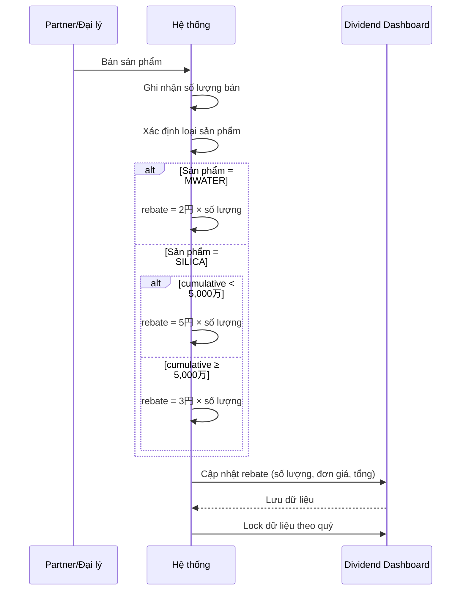
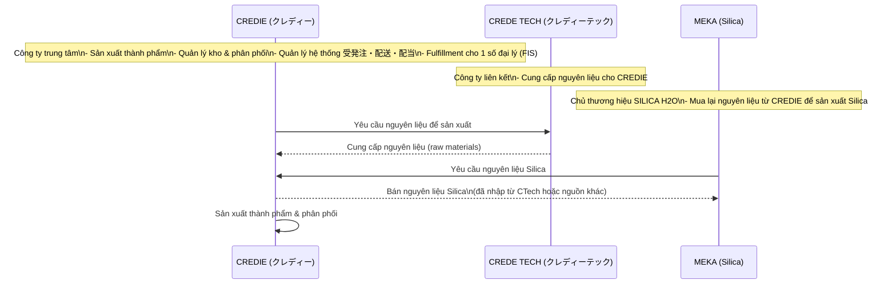
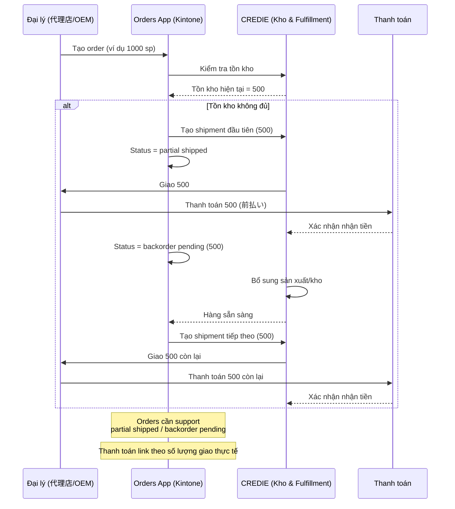

# User Hearing — Hiện trạng kinh doanh và đối tác của CREDIE（Bộ phận Kinh doanh）

## 1) Nhóm khách hàng & đối tác mục tiêu
- Nội bộ: Kinh doanh, Kế toán, Kho, Sản xuất/QA
- Đối tác kinh doanh:
  - Đại lý B2B (Agency) — đặt hàng, quản lý công nợ, chiết khấu
  - FIS（đại lý đặc biệt）— bán hàng qua Shopify riêng
  - OEM — sản xuất theo đơn
  - Đối tác giới thiệu/取次店（affiliate）— tạo link giới thiệu, nhận hoa hồng
- Khách hàng B2C: Shopify本店, Amazon, Rakuten

## 2) Kênh & điểm chạm
- EC: Shopify本店, Amazon, Rakuten（hiện tại chuẩn hóa Shopify, các kênh khác từng bước）
- Cổng đại lý/Portal B2B（Guest）: đặt hàng, theo dõi đơn, tải chứng từ
- Cổng đối tác giới thiệu: phát hành link rút gọn, dashboard doanh thu/hoa hồng
- EDI/Portal nhà cung cấp: xác nhận PO, báo ngày giao（分納対応）

## 3) Danh mục sản phẩm & đặc thù vận hành
- Sản phẩm chính: MWATER, SILICA_H2（nước khoáng/vi lượng silica）
- Đặc thù kho:
  - Kho A（尼崎）: tất cả sản phẩm ngoại trừ nước
  - Kho B（岐阜）: sản phẩm nước（ưu tiên bảo quản/luân chuyển）
- Tồn kho tách bạch: 論理在庫（Kintone）vs 実在庫（Shelf×LOT）

### 🏭 **Hiện trạng kho vận**

**Kho hiện tại:**
- Hiện tại chỉ có **1 kho duy nhất (尼崎 - Amagasaki)**
- Tất cả đơn hàng (CREDIE shop & FIS) đều xuất từ kho này
- Trong tương lai: sẽ có thêm **kho thứ 2 (岐阜 - Gifu)** → cần phân tách SKU nào ship từ kho nào (tự động bằng route_rule)

**Hệ thống kho hiện tại có 2 kho:**
1. **Kho nội bộ CREDIE (kho chính)**
2. **Kho Marusho (丸正運送) - kho ký gửi**

#### 🏭 **Kho nội bộ CREDIE**

**Tài liệu/資材:**
- Phần lớn các **ボトル** (chai), **キャップ** (nắp), **ラベル** (nhãn) được lưu tại kho chính
- **段ボール** (thùng carton) các loại size
- Một số tài liệu có ghi chú **"0 丸正在庫"** - nghĩa là không còn trong kho Marusho, chỉ còn ở kho chính

**Nguyên liệu/原料:**
- **イノシトール** (Inositol): Lưu tại kho chính, có LOT và ngày sản xuất
- **田七人参** (Nhân sâm): Kho chính với thông tin LOT chi tiết
- **シリカ粉末・液体**: Các loại Silica ở kho chính

#### 🚛 **Kho Marusho (丸正運送)**

Có **hệ thống mã hóa chi tiết:**

**Tài liệu lưu kho:**
- **B-01 → B-15**: 400ml Pauch (600 cái/thùng)
- **D-01 → D-03**: 500ml Pauch + Cap set (600 cái)
- **E-01 → E-03**: 1L Pauch trắng (300 cái)
- **F-01 → F-10**: 1L Pauch chưa gia công (bạc)
- **G-01 → G-22**: 100mL Bottle (550 chai/thùng)
- **H-01 → H-03**: 100mL 中栓 (nút trong)
- **I-01 → I-09**: 100mL キャップ (nắp)
- **L-01 → L-05**: AL 300mL Bottle
- **M-01, M-02**: AL Trigger

**Sản phẩm hoàn thiện:**
- **Q-1 → Q-25**: FEEASY 1L (20 chai/thùng)
- **R-5 → R-20**: pipimerry P-silica (54 chai/thùng)
- **S-1 → S-23**: Dr's Power Rice Silica PREMIUM (dạng bán thành phẩm)

**📋 Nguyên tắc phân bổ:**
- **Kho chính**: Nguyên liệu, tài liệu sử dụng thường xuyên
- **Kho Marusho**: Tài liệu dự trữ lớn, sản phẩm hoàn thiện chờ xuất khẩu
- **Rotation**: Có thể di chuyển giữa 2 kho (VD: một số item ghi "丸正在庫 0" nghĩa là đã chuyển về kho chính)

## 4) Đơn hàng & Fulfillment
- B2C: Yoom→Kintone（Orders）→ Ship&Co（label, tracking）→ đồng bộ Shopify
- B2B: Portal/Guest → phê duyệt nội bộ → VA/Invoice（GMO）→ Pick/Scan/Ship
- Sản xuất: ghi nhận BOM, X-Out nguyên liệu, X-In thành phẩm（LOT／期限日）
- Xuất mẫu（Sample Out）: movement_type=SAMPLE_OUT, audit đầy đủ

## 5) Tài chính & Thanh toán
- AR（thu）: Virtual Account（VA）qua GMO — /transactions đối soát tự động
- AP（chi）: Payment_Request → CEO承認 → /payments（GMO）— phản ánh phí/kết quả
- Báo cáo & chứng từ: PDF/CSV lưu S3 và liên kết trong Kintone

## 6) Chiết khấu, Rank & Reward/Dividend
- Rank đại lý: Starter/Silver/Gold/Platinum（tính hàng tháng, idempotent）
- RewardRules: sku/category/channel, unit/rate, thời hạn, ưu tiên
- RewardsLedger: ghi nhận theo sự kiện; Refund ghi âm; trạng thái pending/approved/paid
- Dividend/quý: SW 5円→3円 sau mốc 5,000万円; MW 2円 cố định; khóa sổ 四半期末+1日

## 7) Đối tác & Tích hợp bên ngoài
- Ngân hàng: GMOあおぞら（VA, Payments）
- Vận chuyển: Ship&Co（Yamato, Sagawa…）
- Marketplace: Shopify trọng tâm; Amazon/Rakuten từng bước; FIS/Shopify riêng
- Nhà cung cấp: Meka Portal/EDI（PO, 分納, invoice）

## 8) Bảo mật & Vận hành (guardrails)
- Ký số & whitelist IP cho Bank/EC/Webhook; Idempotency; DLQ/Retry
- CloudWatch metrics/alerts; S3 audit log; phân quyền Guest/Portal
- Chứng từ đa ngôn ngữ theo client_id/ngôn ngữ; template động

## 9) Rủi ro & vấn đề cần xác nhận
- Master tồn kho vật lý tại từng kho（WMS vs Kintone）— cơ chế giảm trước/sau xác nhận
- Quy tắc attribution affiliate（last click 30 ngày vs tùy biến）; multi-level（~4階層）
- Danh sách NCC áp dụng Portal/EDI trong phase 1; ngưỡng reorder_point theo SKU×Kho
- Chính sách xuất mẫu: hạn mức theo kỳ/nhân sự; hoàn trả/điều chỉnh

## 10) Lộ trình ngắn hạn (đề xuất)
- Hoàn thiện intake EC (BF-01), Portal B2B (BF-02), Pick/Scan/Ship (BF-03)
- Ổn định AR/AP (BF-04), Auto-PO & Supplier Portal/EDI (BF-05)
- Quý 1: Rewards/Dividend (BF-06) + Rank (BF-07) + Affiliate (BF-08)
- Tăng cường Movement/Sample/Adjustment (System Flow 6) và Warehouse Ops (System Flow 8)

---

## Phụ lục — Hiện trạng kinh doanh (bổ sung)

1) Sản phẩm & Thương hiệu  
- CREDIE nhập nguyên liệu → sản xuất thành phẩm → bán dưới thương hiệu SILICA.

2) Kênh bán hàng EC (B2C)  
- 2 shop Shopify trực tiếp:  
  - Shop ある生活 do CREDIE vận hành  
  - Shop beauty silica do FIS (đại lý) vận hành  
- Đây là kênh bán cho end-user.

3) Đại lý (B2B)  
- 7–8 đại lý tiêu thụ tổng >1,000 sản phẩm/tháng.  
- Đại lý lớn FIS:  
  - Có Shopify riêng để bán B2C  
  - FIS không tự giao; CREDIE giao hộ (fulfillment)  
  - FIS trả CREDIE phí giao hàng và phí lưu kho  
- Các đại lý khác & OEM:  
  - Tự lo giao hàng (CREDIE ship bulk đến kho đại lý/OEM)  
  - Không cần CREDIE giao hộ

4) Affiliate（取次店）  
- Chia sẻ link → khách mua trên Shopify chính của CREDIE  
- Commission tính trực tiếp từ order đó (ghi nhận vào RewardsLedger)

---

## Định nghĩa vai trò (Role Definition)

- **CREDIE**: sản xuất, giữ kho, phân phối, quản lý hệ thống, và đôi khi làm dịch vụ **配送代行 (fulfillment service: FBM)**.
- **Đại lý thường/OEM**: nhập hàng số lượng lớn, tự lo phân phối (không cần CREDIE fulfillment).
- **FIS (đại lý đặc biệt)**: bán B2C qua Shopify riêng nhưng nhờ CREDIE fulfillment (ship hộ, lưu kho, tính phí).
- **Affiliate (取次店)**: chỉ giới thiệu; không vận hành shop; commission được track qua Shopify chính.

👉 Hệ thống cần cover hiện tại:
- EC trực tiếp (2 shop) + Fulfillment cho FIS + Affiliate tracking.
- Các đại lý/OEM khác chưa cần flow 配送代行. Về sau nếu có “đại lý kiểu FIS” sẽ dùng Shopify riêng + CREDIE fulfillment.

---

## Vận hành kho & giao hàng (hiện tại và kế hoạch)

### 1) Kho A（尼崎） — hiện hành
- Tất cả đơn hàng (CREDIE shop & FIS) ship từ kho A.
- Dùng **Ship&Co** để phát hành 送り状 (shipping label); ship_from luôn là kho A.
- CREDIE đã ký hợp đồng với **Yamato** và **佐川 (Sagawa)**.
- Quy trình:
  1. Staff tải CSV đơn hàng từ các EC site → đăng nhập Ship&Co tạo vận đơn
  2. In vận đơn & đóng gói: dán label, đóng gói theo order
  3. Carrier pickup: Ship&Co quyết định Yamato/Sagawa theo rule (khoảng cách/chi phí); carrier pickup tại kho A

### 2) Kho B（岐阜, dự kiến） — kế hoạch
- Cần ký hợp đồng vận chuyển riêng (Yamato/Sagawa khu vực Gifu).
- Thêm profile Ship&Co cho kho B.
- Mapping SKU→warehouse bằng `route_rule`: nếu map về B thì ship_from=B, label in địa chỉ kho B; carrier pickup tại B.

---

## Cách tính giá cho đại lý (掛け率)

1) Mỗi đại lý có **tỷ lệ giảm giá riêng (discount_rate/掛け率)** áp cho toàn bộ sản phẩm (không theo SKU).
   - Ví dụ: Agent A=80% (−20% so với list); Agent B=70% (−30%).
2) Khi đại lý order (Portal B2B/nhập hộ):
   - Giá order = `list_price × discount_rate(agent)`.
3) Quản trị:
   - Quản lý trong `Agent Master` field `discount_rate`.
   - Khi phát sinh invoice: áp đúng discount_rate của agent.

---

## Làm rõ thuật ngữ — 配当 (haitou) = Rebate/Commission theo sản lượng

- “配当” trong ngữ cảnh hệ thống này **không phải cổ tức cho cổ đông** theo nghĩa kế toán.  
- Thực chất là **rebate/commission** trả cho partner/đại lý dựa trên số lượng bán được (販売インセンティブ).

### Vì sao là rebate?
1) Requirement quy định theo sản lượng:  
   - MWATER = 2円/本 cố định  
   - SILICA = 5円/本, khi lũy kế đạt ≥ 5,000万 thì còn 3円/本  
   - Tính theo số lượng bán, không theo lợi nhuận kế toán
2) Hệ thống quản lý trong “Dividend Dashboard” với các trường:  
   - Số lượng bán, Đơn giá rebate, Tổng rebate, Lock dữ liệu theo quý

### Luồng ghi nhận rebate (mermaid)



---

## Quan hệ các công ty liên quan

1) **CREDIE (クレディー)**  
- Công ty trung tâm (khách hàng order phát triển hệ thống).  
- Vai trò: sản xuất thành phẩm, giữ kho, phân phối, quản lý hệ thống 受発注・配送・配当; fulfillment cho một số đại lý đặc biệt (FIS).

2) **CREDE TECH (クレディーテック)**  
- Công ty liên kết với CREDIE.  
- Vai trò: cung cấp nguyên liệu (raw materials) cho CREDIE sản xuất.

3) **MEKA (Silica)**  
- Công ty đứng sau thương hiệu SILICA H2O.  
- Khi cần nguyên liệu để sản xuất Silica, MEKA cũng mua lại từ CREDIE (nguồn nguyên liệu CREDIE nhập từ CREDE TECH hoặc nguồn khác).



---

## Chuỗi cung ứng (supply chain) — tóm tắt

- **CREDE TECH** → cung cấp nguyên liệu (raw materials)  
- **CREDIE** → nhập nguyên liệu, sản xuất thành phẩm (MWATER / SILICA), lưu kho, phân phối (hub trung tâm)  
- **MEKA (Silica)** → thương hiệu Silica; khi cần nguyên liệu cũng nhập qua CREDIE  
- **FIS / Đại lý / OEM** → nhập thành phẩm để bán B2C/B2B (FIS có Shopify riêng, fulfillment do CREDIE)  
- **End-user** → mua qua EC (Shopify/Rakuten/Amazon) hoặc qua đại lý

```mermaid
flowchart LR
    CTECH[CREDE TECH\nRaw Materials] --> CREDIE[CREDIE\nSản xuất • Kho • Phân phối]
    CREDIE --> MEKA[MEKA\nSilica Brand]
    CREDIE --> FIS[FIS\nĐại lý đặc biệt]
    CREDIE --> AGENCIES[Đại lý/OEM]
    FIS --> EC_FIS[Shopify FIS\n(B2C)]
    CREDIE --> EC_MAIN[Shopify/Rakuten/Amazon\n(B2C)]
    AGENCIES --> B2B[Khách B2B]
    EC_FIS --> ENDUSER[End-user]
    EC_MAIN --> ENDUSER
    B2B --> ENDUSER
```

---

## Quy tắc chịu phí giao hàng (Shipping Fee)

1) End-user (B2C trên Shopify/Rakuten/Amazon)  
- Phí ship do end-user trả; thu trực tiếp khi checkout.

2) Đại lý (代理店) & OEM (法人注文/B2B)  
- Phí ship do CREDIE chịu khi xuất bulk tới kho/địa điểm của đại lý/OEM (không cộng thêm phí).  
- Trường hợp đặc biệt FIS: bán B2C qua Shopify riêng và nhờ CREDIE fulfillment → FIS trả phí ship + phí lưu kho cho CREDIE.

---

## Quy tắc xử lý đơn hàng theo đối tượng

### 1) B2C (Shopify/Rakuten/Amazon)
- Hết hàng (Out of stock) → không cho checkout; chỉ mua khi còn tồn kho thực tế
- Thanh toán online bình thường; không có backorder

### 2) Đại lý (代理店) / OEM (B2B)
- Cho phép order vượt tồn (backorder) và tách nhiều lần giao/chi trả
- Nếu tồn không đủ: giao phần có sẵn trước; đại lý thanh toán phần đã giao (必ず前払い); phần còn lại giao sau khi bổ sung, thanh toán trước mỗi lần giao

Implication hệ thống:
- `Orders_App` cần trạng thái: `partial shipped`, `backorder pending`
- Liên kết thanh toán theo số lượng giao thực tế, không theo toàn bộ order
- Phân tách rõ B2C vs B2B flows (hard stop vs backorder)



---

## 📚 Quy trình sản xuất của Credie (Bộ phận sản xuất)

### 1) Các loại sản phẩm do Credie tự sản xuất
#### a. Sản xuất nước uống
- Credie tự sản xuất: nhập 資材 (chai, nắp, nhãn) + 材料 (nước Silica) → thành phẩm
- Có/đang chuẩn hóa BOM và tồn kho nguyên liệu
- Kho A vừa là nơi sản xuất vừa là nơi lưu kho nước

#### b. Mỹ phẩm và “ngoài Nước”
- Hiện đang quản lý như thành phẩm nhập kho (tồn kho, sample), chưa thấy BOM/Materials cho mỹ phẩm
- Có khả năng mỹ phẩm do OEM/Nhà sản xuất khác cung cấp → Credie quản lý tồn & phân phối

### 2) Cập nhật thực tế vận hành sản xuất (2025-09-29)
- Không có kế hoạch sản xuất cố định; sản xuất hàng ngày theo nhu cầu
- Nhân sự sản xuất thường trực ~5–7 người; peak thì thuê part-time
- Ba thao tác chính:
  1. Giảm kho nguyên liệu đã dùng (Materials/資材 xuất theo BOM)
  2. Tăng kho thành phẩm sau khi hoàn thành (Production complete)
  3. Phát hành PO nguyên liệu khi kho xuống ngưỡng (reorder_point)

---

# Vai trò nhân viên trong Credie (Bộ phận vận hành)

## 1) Nhân viên kho（倉庫担当）
- Phạm vi thao tác: xuất/nhập kho; scan barcode để ghi nhận di chuyển
- Xuất kho không gắn đơn bán: bắt buộc chọn lý do (lỗi hỏng, thất lạc, xuất mẫu, kiểm định, dùng nội bộ, khác)
- Nhập kho: scan mã kệ (棚) và mã hàng để ghi vị trí tồn
- Quy trình xuất kho gợi ý:
  1. Tạo picking list từ đơn hàng/phiếu xuất nội bộ
  2. Xác nhận vị trí kệ (棚) và LOT
  3. Scan kệ + barcode sản phẩm, lấy hàng
  4. Kiểm đếm; nếu không gắn đơn bán → chọn lý do xuất
  5. Xác nhận xuất trên hệ thống, in chứng từ nếu cần
  6. Hệ thống cập nhật tồn kho và ghi Stock Movement để truy vết
- Nhận hàng nguyên vật liệu từ supplier, kiểm đếm và nhập kho
- Quản lý tồn kho thành phẩm + nguyên liệu (chai, nắp, nhãn, nước thô, mỹ phẩm nhập về)
- Quản lý xuất mẫu（営業サンプル）và điều chỉnh tồn

## 2) Nhân viên sản xuất（製造担当）
- Theo dõi BOM (chai, nắp, nhãn, nước)
- Ghi nhận lượng nguyên liệu đã sử dụng cho mỗi batch
- Bàn giao thành phẩm cho kho → cập nhật tồn kho thành phẩm

## 3) Nhân viên đơn hàng（受注担当）
- Tiếp nhận đơn B2B từ đại lý qua mail/FAX, nhập tay vào hệ thống
- Theo dõi đơn từ EC (Shopify, FIS shop) đồng bộ về Kintone qua Yoom
- Kiểm tra trạng thái thanh toán (Paid/Unpaid); chỉ giao sau khi nhận tiền từ Agency và phát hành 請求書
- Liên hệ kho để sắp xếp giao hàng

## 4) Nhân viên giao vận/配送担当
- Phát hành 送り状 trên Ship&Co (trước đây CSV upload)
- Hiện tại B2C dùng Ship&Co; B2B tự in/viết tay (định hướng số hóa: dùng Ship&Co cho cả B2B)
- Liên hệ Yamato/佐川 để pickup (tương lai tự động)
- Xác nhận tracking_no và thông báo cho khách (tương lai cập nhật tự động qua API)

## 5) Nhân viên mua hàng（購買担当）
- Theo dõi tồn kho nguyên liệu（資材）
- Khi dưới ReorderPoint → phát hành 発注書 và liên hệ supplier
- Thanh toán trước với Meka (前払い) trước khi chốt order, phát hành 支払書
- Quản lý納期 và phối hợp kiểm hàng khi nhập

## 6) Nhân viên kế toán/tài chính（経理担当）
- Đối soát thanh toán từ đại lý (ngân hàng)
- Quản lý chi trả 配当（rebate/dividend）và hoa hồng affiliate（chu kỳ: 請求書・領収書）

## 7) Nhân viên kinh doanh/sales（営業担当）
- Liên hệ đại lý, theo dõi rank và ưu đãi
|- Quản lý affiliate（取次店）→ phát hành link giới thiệu（một số đại lý khối lượng lớn chuyển sang affiliate）
- Ghi nhận việc xuất hàng mẫu cho khách hàng tiềm năng

